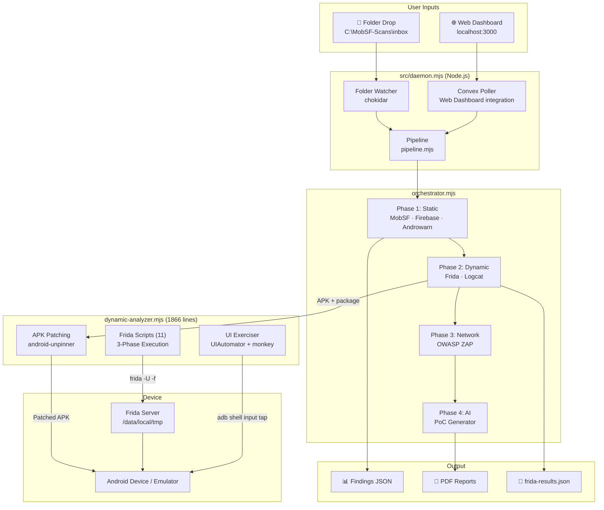
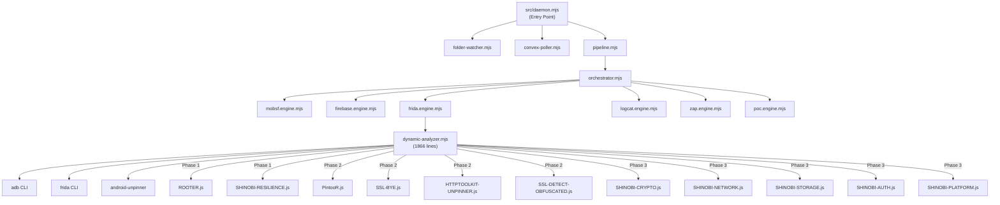
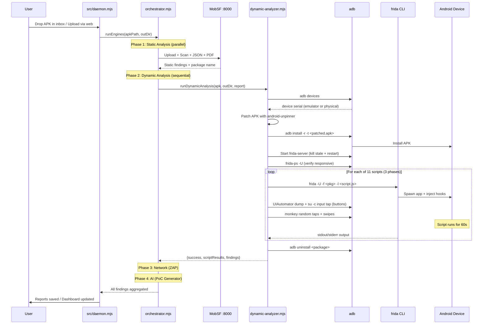
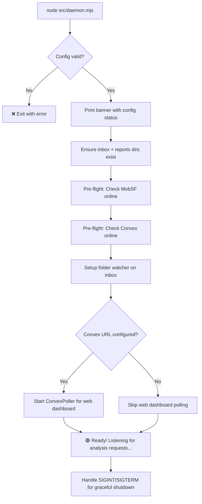
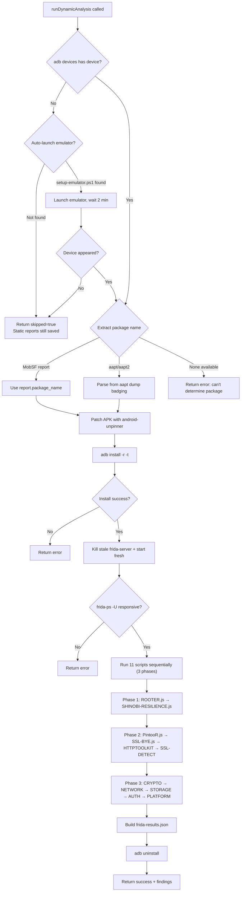
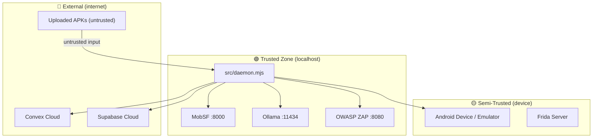

# 📐 ARCHITECTURE.md — WORMHOLE // Shinodroid 忍ドロイド

> **Version:** 2.0.0 &nbsp;|&nbsp; **Last Updated:** 2026-08-13 &nbsp;|&nbsp; **Maintainer:** Shinodroid Team

---

## Table of Contents

1. [Project Overview](#1-project-overview)
2. [System Architecture](#2-system-architecture)
3. [Component Inventory](#3-component-inventory)
4. [Data Flow](#4-data-flow)
5. [Control Flow](#5-control-flow)
6. [Module Reference](#6-module-reference)
7. [Frida Script Reference](#7-frida-script-reference)
8. [API Reference](#8-api-reference)
9. [Configuration Reference](#9-configuration-reference)
10. [Security Model](#10-security-model)
11. [Deployment & Infrastructure](#11-deployment--infrastructure)
12. [Contributing Guide](#12-contributing-guide)

---

## 1. Project Overview

### 1.1 Purpose

**WORMHOLE // Shinodroid 忍ドロイド** is an automated Android application security analysis platform that orchestrates multiple industry tools through a unified daemon service and plugin-based engine architecture. Drop an APK — it runs every analysis tool automatically and produces a professional, documented security report.

### 1.2 Key Capabilities

| Capability | Description |
|---|---|
| **Drop-and-scan** | Place an APK in `C:\MobSF-Scans\inbox` → full static + dynamic + network reports |
| **Web Dashboard** | Next.js dashboard with Convex real-time database for scan management |
| **8-Engine Orchestrator** | Pluggable engine system runs static, dynamic, network, and AI analysis |
| **11 Frida Scripts** | 3-phase instrumentation: root bypass → SSL bypass → behavioral monitoring |
| **Physical Device Support** | Works on rooted physical devices (including MIUI/Xiaomi) and emulators |
| **Automated UI Exerciser** | UIAutomator + monkey-based automated button tapping and swiping |
| **android-unpinner** | Automatic APK patching to disable SSL pinning at the APK level |
| **Graceful degradation** | If no emulator/device is connected, dynamic analysis is skipped — static reports still generated |

### 1.3 Technology Stack

| Layer | Technology | Version |
|---|---|---|
| Runtime | Node.js (ESM) | ≥22.0.0 |
| Static Analysis | MobSF | v4.4.5 (Django/Python) |
| Dynamic Analysis | Frida (frida-tools) | 16.x / 17.x |
| Network Analysis | OWASP ZAP | v2.16.0 |
| Device Communication | ADB (Android Debug Bridge) | SDK Platform-Tools |
| Real-time Database & Auth | Convex | Latest |
| Storage & Backup DB | Supabase | Latest |
| Web Framework | Next.js (TypeScript) | Latest |
| File Watcher | chokidar | ^4.0.0 |
| PDF Generation | PDFKit + Puppeteer | Latest |

---

## 2. System Architecture

### 2.1 High-Level Architecture



### 2.2 Engine Orchestrator Phases

The orchestrator (`orchestrator.mjs`) discovers engines dynamically from the `engines/` directory and runs them in a strict phase order:

```
Phase 1: Static Analysis    → MobSF, Firebase, Androwarn     (parallel)
Phase 2: Dynamic Analysis   → Frida, Logcat                  (sequential — share device)
Phase 3: Network Analysis   → OWASP ZAP                      (sequential)
Phase 4: AI Analysis        → PoC Exploit Generator           (last — consumes all findings)
```

---

## 3. Component Inventory

### 3.1 Project File Map

```
WORMHOLE-SHINODROID/
│
├── src/                            # Daemon service (entry point)
│   ├── daemon.mjs                  # Main entry — banner, watchers, poller, shutdown
│   ├── config/
│   │   └── config.mjs              # Environment variable loader + defaults
│   ├── core/
│   │   └── pipeline.mjs            # Scan pipeline — orchestrates engines per APK
│   ├── io/
│   │   ├── folder-watcher.mjs      # chokidar-based inbox watcher
│   │   └── convex-poller.mjs       # Polls Convex for web dashboard scans
│   ├── services/
│   │   ├── convex.service.mjs      # Convex API client (real-time DB)
│   │   └── mobsf.service.mjs       # MobSF REST API client
│   └── utils/
│       ├── logger.mjs              # Timestamped console logger with emoji prefixes
│       ├── helpers.mjs             # Shared utility functions
│       ├── sanitizer.mjs           # Input sanitization
│       └── compliance-map.mjs      # OWASP/MASVS compliance mapping
│
├── engines/                        # Pluggable analysis engine plugins
│   ├── _engine-interface.mjs       # Engine contract/interface definition
│   ├── mobsf.engine.mjs            # MobSF static analysis
│   ├── firebase.engine.mjs         # Firebase misconfiguration scanner
│   ├── androwarn.engine.mjs        # Android malicious behavior detection
│   ├── frida.engine.mjs            # Frida dynamic instrumentation (wraps dynamic-analyzer.mjs)
│   ├── logcat.engine.mjs           # Runtime log leak detection
│   ├── zap.engine.mjs              # OWASP ZAP network proxy analysis
│   ├── ai.engine.mjs               # AI report generation (Ollama)
│   └── poc.engine.mjs              # PoC exploit code generator
│       └── poc-templates/
│           └── index.mjs           # Exploit template library
│
├── scripts/                        # Frida instrumentation scripts (11 scripts)
│   ├── ROOTER.js                   # [Phase 1] Root detection bypass
│   ├── SHINOBI-RESILIENCE.js       # [Phase 1] Anti-tamper / anti-debug bypass
│   ├── PintooR.js                  # [Phase 2] Combined SSL + root bypass
│   ├── SSL-BYE.js                  # [Phase 2] Comprehensive SSL pinning bypass (30+ methods)
│   ├── HTTPTOOLKIT-UNPINNER.js     # [Phase 2] HTTPToolkit SSL bypass (via android-unpinner)
│   ├── SSL-DETECT-OBFUSCATED.js    # [Phase 2] Obfuscated/native SSL detection (observational)
│   ├── SHINOBI-CRYPTO.js           # [Phase 3] Crypto API monitoring
│   ├── SHINOBI-NETWORK.js          # [Phase 3] Network traffic monitoring
│   ├── SHINOBI-STORAGE.js          # [Phase 3] Storage/file I/O monitoring
│   ├── SHINOBI-AUTH.js             # [Phase 3] Auth/credentials monitoring
│   └── SHINOBI-PLATFORM.js         # [Phase 3] Platform API monitoring
│
├── dynamic-analyzer.mjs            # Frida + ADB automation module (1866 lines)
├── orchestrator.mjs                # Engine discovery + execution orchestrator
├── custom-hooks-generator.mjs      # Generates Frida hooks from MobSF static findings
├── ui-explorer.mjs                 # Automated UI exploration with ZAP proxy
├── generate-dynamic-pdf.mjs        # Dynamic analysis PDF report generator
│
├── web/                            # Next.js web dashboard (TypeScript)
│   ├── src/                        # Dashboard pages, components, API routes
│   ├── convex/                     # Convex schema, mutations, queries
│   ├── public/                     # Static assets
│   ├── package.json                # Web dashboard dependencies
│   └── supabase-*.sql              # Database migration scripts
│
├── reporting/                      # Markdown + Mermaid → PDF converter
│
├── .env.example                    # Environment variable template
├── setup-emulator.ps1              # One-time emulator + Frida setup
├── harden-firewall.ps1             # Windows firewall rules for MobSF
├── package.json                    # Root project dependencies
└── README.md                       # User-facing documentation
```

### 3.2 Dependency Graph



---

## 4. Data Flow

### 4.1 APK Scan Pipeline — Complete Data Flow



### 4.2 Data Artifacts Per Scan

Each scan produces a timestamped directory under `C:\MobSF-Scans\reports\`:

```
<app_name>-<YYYY-MM-DDTHH-MM-SS>/
├── report.json          # MobSF full JSON report
├── report.pdf           # MobSF formatted PDF report
├── frida-results.json   # Dynamic analysis output (11 scripts)
│   ├── device: "192.168.137.167:40145"
│   ├── packageName: "com.example.app"
│   ├── scripts[]
│   │   ├── name: "Root Detection Bypass"
│   │   ├── success: true/false
│   │   └── output: ["[+] Bypass root check...", ...]
│   └── summary
│       ├── totalScripts: 11
│       ├── successful: 11
│       ├── sslBypasses: 5
│       ├── rootBypasses: 2
│       └── totalHooks: 45+
├── dynamic-report.pdf   # Dynamic analysis PDF report
└── custom-hooks/        # AI-free custom hooks generated from static findings
```

---

## 5. Control Flow

### 5.1 Application Startup



### 5.2 Dynamic Analysis Decision Tree



### 5.3 Error Handling Strategy

| Component | Error | Behavior |
|---|---|---|
| MobSF connection | `ECONNREFUSED` | Scan fails with descriptive error |
| No device | `adb devices` empty | Attempts auto-launch emulator, then skips dynamic |
| APK install fail | `adb install` error | Dynamic analysis fails, static continues |
| Frida spawn fail | Non-zero exit code | Falls back to attach mode (launch app + attach) |
| Frida timeout | 60s elapsed | Process killed, output captured, marked success |
| `input tap` SecurityException | MIUI blocks injection | Retries via `su -c 'input tap'` (root bypass) |
| android-unpinner crash | stderr: Aborted | Falls back to original APK (unpinned version skipped) |
| Screen resolution mismatch | Physical device | Auto-detected via `adb shell wm size` |

---

## 6. Module Reference

### 6.1 `src/daemon.mjs` — Main Daemon Service

**Entry Point:** `node src/daemon.mjs` (or `npm start`)

Responsibilities:
- Prints startup banner with config status (MobSF URL, inbox path, Convex status)
- Ensures required directories exist
- Runs pre-flight checks against MobSF and Convex
- Starts `folder-watcher.mjs` (chokidar on inbox directory)
- Starts `convex-poller.mjs` (polls web dashboard for pending scans)
- Handles graceful shutdown on SIGINT/SIGTERM

---

### 6.2 `orchestrator.mjs` — Engine Discovery & Execution

**Lines:** ~450 &nbsp;|&nbsp; **Key Export:** `discoverEngines()`, `runEngines()`

Engine execution order is defined by `TYPE_ORDER`:
```
static → dynamic → network → sca → ai
```

Discovery: reads `engines/*.engine.mjs`, validates each against the engine interface contract (`_engine-interface.mjs`), and sorts by type.

| Engine File | Type | Description |
|---|---|---|
| `mobsf.engine.mjs` | static | MobSF upload, scan, JSON + PDF download |
| `firebase.engine.mjs` | dynamic | Firebase URL misconfiguration scanner |
| `androwarn.engine.mjs` | static | Android malicious behavior detection |
| `frida.engine.mjs` | dynamic | Wraps `dynamic-analyzer.mjs` for Frida instrumentation |
| `logcat.engine.mjs` | dynamic | Runtime log leak detection via `adb logcat` |
| `zap.engine.mjs` | network | OWASP ZAP proxy-based network analysis |
| `ai.engine.mjs` | ai | AI report generation via Ollama |
| `poc.engine.mjs` | ai | PoC exploit code generator from findings |

---

### 6.3 `dynamic-analyzer.mjs` — Frida + ADB Automation

**Lines:** 1866 &nbsp;|&nbsp; **Exports:** `runDynamicAnalysis()`, `checkEmulator()`

This is the largest module in the project. It handles the entire dynamic analysis lifecycle.

| Function | Purpose |
|---|---|
| `checkEmulator()` | Parses `adb devices` output for connected devices |
| `launchEmulator()` | Auto-launches emulator via `setup-emulator.ps1` |
| `installApk(apkPath)` | Runs `adb install -r -t <path>` with timeout |
| `uninstallApk(packageName)` | Best-effort `adb uninstall` cleanup |
| `extractSdkInfo(report, apkPath)` | Extracts min/target/max SDK from MobSF → aapt → aapt2 |
| `ensureFridaServer()` | Kills stale server, starts fresh, verifies via `frida-ps -U` |
| `runFridaScript(pkg, scriptPath, name)` | Spawns `frida -U -f <pkg> -l <script>`, with attach-mode fallback |
| `exerciseApp(packageName)` | Auto-detects screen resolution, taps all clickable elements via UIAutomator, then random monkey events. Uses `su -c` for MIUI compatibility. |
| `ensureAppForeground(packageName)` | Checks if app is in foreground, re-launches if not |
| `runDynamicAnalysis(apkPath, outDir, report, onProgress)` | **Main entry** — full pipeline orchestration |
| `parseOutputToFindings(results, scanId)` | Converts Frida output into structured finding objects |
| `detectHookInstallations(results, scanId)` | Detects `[SSL_HOOK_INSTALLED]` / `[ROOT_BYPASS]` tags |

**Key Constants:**

| Constant | Value | Purpose |
|---|---|---|
| `SCRIPTS_DIR` | `./scripts/` | Frida script directory |
| `FRIDA_SCRIPT_TIMEOUT` | 60,000ms (env: `FRIDA_TIMEOUT_MS`) | How long each script runs |
| `ADB` | `"adb"` | ADB binary (must be in PATH) |
| `UNPINNER` | `"android-unpinner"` | APK patching tool |
| `targetSerial` | Auto-detected or `ANDROID_SERIAL` env | Device serial for multi-device support |

---

## 7. Frida Script Reference

### 7.1 Execution Order

> ⚠️ **ORDER MATTERS.** Root detection bypass MUST run first. Many apps call `System.exit()` on startup if root is detected. If SSL hooks run first, the app crashes before making any network call.

Scripts are defined in `dynamic-analyzer.mjs` at line ~1603 and executed sequentially. Each script runs for 60 seconds with automated UI tapping.

### 7.2 Phase 1: Anti-Tamper & Root Detection Bypass

These scripts run **first** to keep the app alive for subsequent phases.

| # | Script | Lines | Purpose | Key Hooks |
|---|---|---|---|---|
| 1 | `ROOTER.js` | 342 | Root detection bypass | `PackageManager.getPackageInfo` (25 root packages), `File.exists` (7 binaries), `Runtime.exec` (6 overloads), `ProcessBuilder.start`, `SystemProperties.get`, native `fopen`/`system` interception, build tags patching |
| 2 | `SHINOBI-RESILIENCE.js` | ~300 | Anti-tamper / anti-debug bypass | `Debug.isDebuggerConnected`, `Debug.waitingForDebugger`, `System.exit()` blocking, native `strstr`/`open`/`connect` (Frida-string and Frida-port detection), TracerPid neutralization, emulator fingerprint logging |

### 7.3 Phase 2: SSL/TLS Pinning Bypass

With root detection neutralized, these scripts disable SSL pinning so network traffic can be intercepted.

| # | Script | Lines | Purpose | Key Hooks |
|---|---|---|---|---|
| 3 | `PintooR.js` | ~500 | Combined SSL + root bypass | Merged SSL and root bypass in a single script |
| 4 | `SSL-BYE.js` | 729 | Comprehensive SSL pinning bypass (30+ methods) | TrustManager, OkHTTPv3 (×4), Trustkit (×3), Conscrypt, OpenSSL, PhoneGap, IBM MobileFirst, IBM WorkLight (×4), Netty, Squareup (×2), WebViewClient (×4), Cordova, Boye, Apache, Chromium Cronet, Flutter (×2), Dynamic SSLPeerUnverified patcher |
| 5 | `HTTPTOOLKIT-UNPINNER.js` | ~600 | HTTPToolkit SSL bypass | Executed via `android-unpinner` APK patching — patches the APK itself as debuggable, injects Frida gadget via JDWP |
| 6 | `SSL-DETECT-OBFUSCATED.js` | ~150 | Obfuscated/native SSL detection (observational only) | Walks loaded classes for `X509TrustManager` implementations, hooks native BoringSSL/OpenSSL `SSL_CTX_set_custom_verify`, `SSL_set_verify`, `SSL_get_verify_result` — **logs only, no bypass** |

### 7.4 Phase 3: Behavioral Monitoring

Passive observation scripts that log what the app does during the automated UI walkthrough.

| # | Script | Lines | Purpose | Key Hooks |
|---|---|---|---|---|
| 7 | `SHINOBI-CRYPTO.js` | ~300 | Crypto API monitoring | `Cipher`, `SecretKeySpec`, `KeyGenerator`, `MessageDigest`, `Mac`, `SecureRandom`, `KeyStore`, `Signature`, `Base64`, `IvParameterSpec` — flags weak algorithms (DES/RC4/ECB), short keys, weak hashes (MD5/SHA-1), static IVs |
| 8 | `SHINOBI-NETWORK.js` | ~250 | Network traffic monitoring | `URL.openConnection`, `HttpURLConnection`, `HttpsURLConnection.setHostnameVerifier`, OkHttp3 request/response, WebView URL loads, DNS lookups, raw Socket construction — flags cleartext HTTP |
| 9 | `SHINOBI-STORAGE.js` | ~350 | Storage/file I/O monitoring | `SharedPreferences` get/put, SQLite `execSQL`/`rawQuery`/`insert`, `FileOutputStream`/`FileInputStream`, clipboard read/write, `ContentResolver`, `Log.d` — flags sensitive keys/values, external storage writes |
| 10 | `SHINOBI-AUTH.js` | ~300 | Auth/credentials monitoring | `BiometricPrompt`, AndroidX biometric, legacy `FingerprintManager`, `AccountManager`, `KeyguardManager`, WebView `addJavascriptInterface`/`evaluateJavascript`, cookie-setting for session tokens |
| 11 | `SHINOBI-PLATFORM.js` | ~280 | Platform API monitoring | Intent construction/extras, `startActivity`/`startActivityForResult`, `sendBroadcast`, `PendingIntent` mutability flags, `ContentProvider.query`, notifications, `Runtime.exec` — flags sensitive data in Intent extras, mutable PendingIntents |

---

## 8. API Reference

### 8.1 MobSF REST API (consumed by this project)

All requests require header: `Authorization: <MOBSF_API_KEY>`

| Endpoint | Method | Body | Response |
|---|---|---|---|
| `/api/v1/upload` | POST | Multipart/form-data with `file` | `{hash, file_name, scan_type}` |
| `/api/v1/scan` | POST | `hash=<md5>` | Scan result JSON |
| `/api/v1/report_json` | POST | `hash=<md5>` | Full security report |
| `/api/v1/download_pdf` | POST | `hash=<md5>` | PDF binary |
| `/api/v1/scans` | GET | `?page=1&page_size=10` | `{content: [...], count, num_pages}` |
| `/api/v1/scorecard` | POST | `hash=<md5>` | Security scorecard |

---

## 9. Configuration Reference

### 9.1 Environment Variables (`.env`)

| Variable | Required | Default | Description |
|---|---|---|---|
| `MOBSF_API_KEY` | ✅ | — | MobSF REST API key (SHA-256 of `~/.MobSF/secret`) |
| `MOBSF_URL` | ❌ | `http://127.0.0.1:8000` | MobSF server URL (must be localhost) |
| `APK_INBOX_DIR` | ❌ | `C:\MobSF-Scans\inbox` | Watch directory for APK drops |
| `REPORTS_OUTPUT_DIR` | ❌ | `C:\MobSF-Scans\reports` | Where reports are saved |
| `FRIDA_TIMEOUT_MS` | ❌ | `60000` | Per-script Frida timeout in milliseconds |
| `ANDROID_SERIAL` | ❌ | Auto-detected | Target device serial (for multi-device setups) |
| `FRIDA_SCRIPTS_FILTER` | ❌ | — | Comma-separated filter to run subset of scripts (e.g. `SSL,PintooR`) |
| `CONVEX_DEPLOY_KEY` | ✅ (worker) | — | Convex deploy key for scan worker |
| `NEXT_PUBLIC_CONVEX_URL` | ✅ (web) | — | Convex deployment URL |
| `NEXT_PUBLIC_SUPABASE_URL` | ✅ | — | Supabase project URL |
| `NEXT_PUBLIC_SUPABASE_ANON_KEY` | ✅ | — | Supabase anonymous/public key |
| `SUPABASE_SERVICE_ROLE_KEY` | ✅ | — | Supabase service role secret key |
| `OLLAMA_URL` | ❌ | `http://127.0.0.1:11434` | Ollama LLM server URL |
| `OLLAMA_MODEL` | ❌ | `minimax-m2.7:cloud` | Ollama model name for AI reports |
| `ZAP_API_KEY` | ❌ | `shinodroid-zap-key` | OWASP ZAP API key |
| `SHINODROID_ADMIN_SECRET` | ❌ | — | Admin secret for CI/CD API key generation |

---

## 10. Security Model

### 10.1 Trust Boundaries



### 10.2 Security Controls

| Control | Implementation | Status |
|---|---|---|
| API authentication | Token-based header auth for MobSF | ✅ Enabled |
| SSRF prevention | URL restricted to loopback | ✅ Enforced |
| Path traversal protection | Reject `..` in file paths | ✅ Enforced |
| File type validation | Extension allowlist + magic bytes | ✅ Enforced |
| Response size limits | 10-20 MB caps | ✅ Enforced |
| Request timeouts | AbortController (2-3 min) | ✅ Enforced |
| Credential encryption | Plaintext in config files | ❌ Not implemented |
| SELinux handling | `setenforce 0` required on physical devices | ⚠️ Manual step |

---

## 11. Deployment & Infrastructure

### 11.1 Prerequisites

| Software | Version | Install |
|---|---|---|
| Node.js | ≥22.0.0 | [nodejs.org](https://nodejs.org) |
| Python | ≥3.9 | [python.org](https://python.org) |
| Android Studio | Latest | [developer.android.com](https://developer.android.com/studio) |
| MobSF | v4.4.5 | `git clone https://github.com/MobSF/Mobile-Security-Framework-MobSF` |
| Frida | 16.x / 17.x | `pip install frida-tools` |
| android-unpinner | Latest | `pip install android-unpinner` |
| OWASP ZAP | v2.16.0 | [zaproxy.org](https://www.zaproxy.org/download/) |

### 11.2 Device Setup

**Option A: Emulator (Recommended for first-time users)**
```powershell
.\setup-emulator.ps1
```

**Option B: Physical Rooted Device (MIUI/Xiaomi)**
1. Enable USB Debugging + "USB debugging (Security settings)" in Developer Options
2. Set SELinux to permissive: `adb shell su -c "setenforce 0"`
3. Push frida-server: `adb push frida-server /data/local/tmp/ && adb shell chmod 755 /data/local/tmp/frida-server`
4. Start frida-server as root: `adb shell su -c "/data/local/tmp/frida-server -D"`

### 11.3 Running

```powershell
# Terminal 1 — Start MobSF
cd Mobile-Security-Framework-MobSF && .\run.bat

# Terminal 2 — Start Shinodroid daemon
cd WORMHOLE-SHINODROID
$env:SKIP_AI="true"  # Optional: skip AI engines
node .\src\daemon.mjs

# Terminal 3 — Web dashboard (optional)
cd web && npm run dev
```

---

## 12. Contributing Guide

### 12.1 Code Style

- **Language:** JavaScript (ESM — `import`/`export`, `.mjs` extension)
- **Formatting:** 4-space indentation
- **Naming:** `camelCase` for functions/variables, `UPPER_SNAKE` for constants
- **Comments:** JSDoc on all exported functions

### 12.2 Adding a New Frida Script

1. Create your script in `scripts/my-script.js`
2. Add it to the `scripts` array in `dynamic-analyzer.mjs` → `runDynamicAnalysis()` (line ~1603):
   ```javascript
   const scripts = [
       // Phase 1: Anti-tamper
       { name: "Root Detection Bypass", file: join(SCRIPTS_DIR, "ROOTER.js") },
       { name: "Resilience Bypass", file: join(SCRIPTS_DIR, "SHINOBI-RESILIENCE.js") },
       // Phase 2: SSL bypass
       { name: "Combined Bypass (PintooR)", file: join(SCRIPTS_DIR, "PintooR.js") },
       { name: "SSL Pinning Bypass", file: join(SCRIPTS_DIR, "SSL-BYE.js") },
       { name: "HTTPToolkit SSL Bypass", file: join(SCRIPTS_DIR, "HTTPTOOLKIT-UNPINNER.js") },
       { name: "SSL Obfuscated/Native Detection", file: join(SCRIPTS_DIR, "SSL-DETECT-OBFUSCATED.js") },
       // Phase 3: Behavioral monitoring
       { name: "Crypto Monitor", file: join(SCRIPTS_DIR, "SHINOBI-CRYPTO.js") },
       { name: "Network Monitor", file: join(SCRIPTS_DIR, "SHINOBI-NETWORK.js") },
       { name: "Storage Monitor", file: join(SCRIPTS_DIR, "SHINOBI-STORAGE.js") },
       { name: "Auth Monitor", file: join(SCRIPTS_DIR, "SHINOBI-AUTH.js") },
       { name: "Platform Monitor", file: join(SCRIPTS_DIR, "SHINOBI-PLATFORM.js") },
       { name: "My Custom Script", file: join(SCRIPTS_DIR, "my-script.js") },  // ← add here
   ];
   ```
3. Test: drop an APK → verify your script output appears in `frida-results.json`

### 12.3 Adding a New Engine

1. Create `engines/my-engine.engine.mjs`
2. Export the engine contract interface (see `_engine-interface.mjs`):
   ```javascript
   export const meta = {
       engineId: "my-engine",
       name: "My Custom Engine",
       version: "1.0.0",
       type: "static",  // static | dynamic | network | sca | ai
   };
   export async function isAvailable() { return true; }
   export async function run(context) { return { findings: [] }; }
   ```
3. The orchestrator auto-discovers it on next startup.

### 12.4 Testing Checklist

- [ ] `node --check src/daemon.mjs` — syntax validation
- [ ] `node --check dynamic-analyzer.mjs` — syntax validation
- [ ] Drop test APK in inbox → verify all engines run
- [ ] If device connected → verify `frida-results.json` with 11 script results
- [ ] Web dashboard → upload APK → verify real-time updates

### 12.5 Known Limitations

| Limitation | Workaround |
|---|---|
| Frida scripts run sequentially (~11 min total for 11 scripts at 60s each) | Use `FRIDA_SCRIPTS_FILTER` to run a subset |
| Only one device supported at a time | Set `ANDROID_SERIAL` for specific device targeting |
| No IPA dynamic analysis | Frida scripts are Android-only |
| MIUI blocks `input tap` via ADB | Uses `su -c 'input tap'` fallback (requires root) |
| Physical devices need manual SELinux + frida-server setup | See Section 11.2 |

---

*WORMHOLE // Shinodroid 忍ドロイド — Built for Android Security Research*
