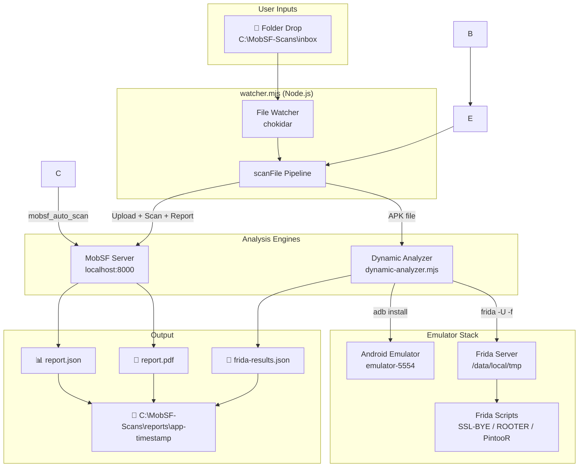
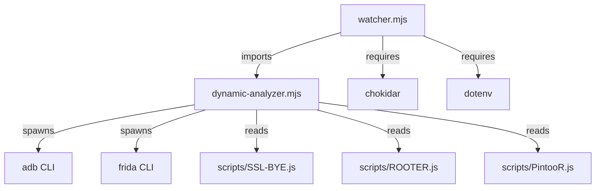
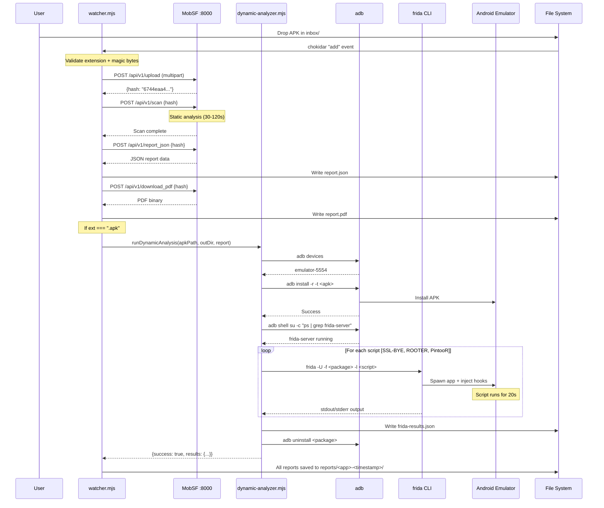
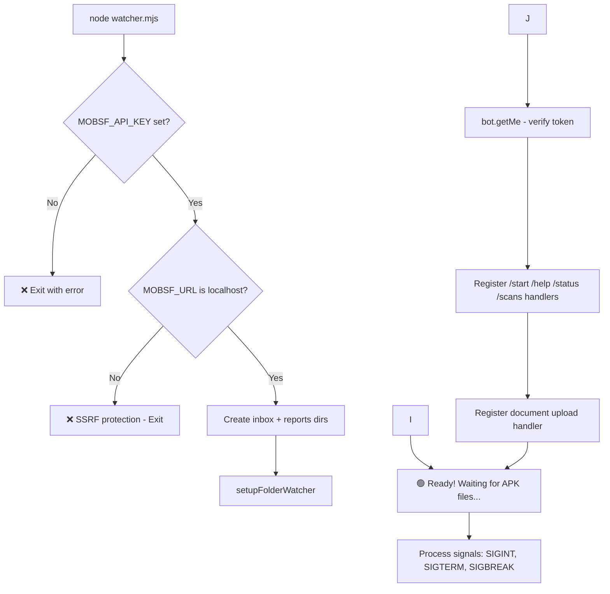
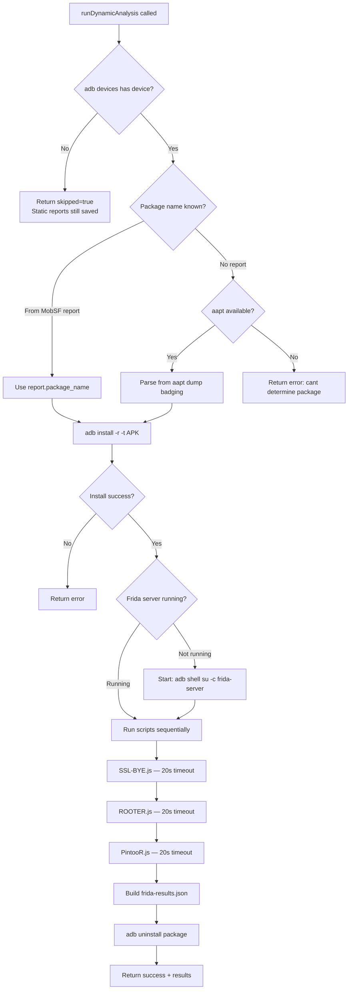
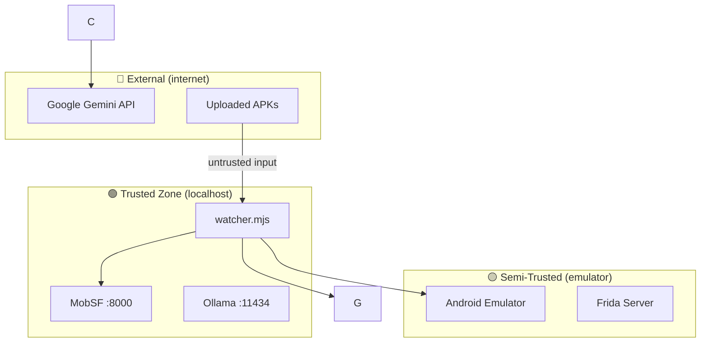

# 📐 ARCHITECTURE.md — WORMHOLE // Shinodroid 忍ドロイド

> **Version:** 1.0.0 &nbsp;|&nbsp; **Last Updated:** 2026-02-22 &nbsp;|&nbsp; **Maintainer:** Shinodroid Team

---

## Table of Contents

1. [Project Overview](#1-project-overview)
2. [System Architecture](#2-system-architecture)
3. [Component Inventory](#3-component-inventory)
4. [Data Flow](#4-data-flow)
5. [Control Flow](#5-control-flow)
6. [Module Reference](#6-module-reference)
7. [API Reference](#7-api-reference)
8. [Configuration Reference](#8-configuration-reference)
9. [Security Model](#9-security-model)
10. [Deployment & Infrastructure](#10-deployment--infrastructure)
11. [Contributing Guide](#11-contributing-guide)

---

## 1. Project Overview

### 1.1 Purpose

**WORMHOLE // Shinodroid 忍ドロイド** is an automated Android application security analysis platform that combines three industry tools into a single drop-and-scan pipeline:

| Tool | Analysis Type | Automation Level |
|------|--------------|------------------|
| **MobSF** (Mobile Security Framework) | Static analysis — code, permissions, manifest, cryptography | Fully automated per APK |
| **Frida** | Dynamic instrumentation — SSL pinning bypass, root detection bypass, runtime hooking | Fully automated per APK (requires emulator) |
| **BrutDroid** | Emulator provisioning — create, root, configure Android emulators | One-time manual setup |

### 1.2 Key Capabilities

- **Drop-and-scan**: Place an APK in `C:\MobSF-Scans\inbox` → get full static + dynamic reports
- **Graceful degradation**: If no emulator is running, dynamic analysis is skipped — static reports still generated

### 1.3 Technology Stack

| Layer | Technology | Version |
|-------|-----------|---------|
| Runtime | Node.js (ESM) | ≥22.0.0 |
| Static Analysis | MobSF | v4.4.5 (Django/Python) |
| Dynamic Analysis | Frida (frida-tools) | 16.7.19 |
| Emulator Management | BrutDroid + Android Studio | v2.0 |
| Device Communication | ADB (Android Debug Bridge) | SDK Platform-Tools |
| File Watcher | chokidar | ^4.0.0 |

---

## 2. System Architecture

### 2.1 High-Level Architecture



### 2.2 Component Interaction Map

```mermaid
graph LR
    subgraph Node.js Process
        W[watcher.mjs]
        DA[dynamic-analyzer.mjs]
    end

    subgraph External Services
        MOBSF[MobSF :8000]
    end

    subgraph Local Tools
        ADB[adb]
        FRIDA[frida CLI]
    end

        PLUGIN[extensions/mobsf/index.mjs]
    end

    W -->|HTTP REST| MOBSF
    W -->|Bot API| TG
    W -->|import| DA
    DA -->|child_process.execFile| ADB
    DA -->|child_process.spawn| FRIDA
    PLUGIN -->|HTTP REST| MOBSF
    OC -->|loads| PLUGIN
```

---

## 3. Component Inventory

### 3.1 Project File Map

```
OPENCLAW-SECURITY-INTEGRITY/
│
├── watcher.mjs                 # Main service — orchestrates everything
│   ├── Folder watcher (chokidar)
│   ├── scanFile() pipeline
│   └── Report formatting
│
├── dynamic-analyzer.mjs        # Frida + ADB automation module
│   ├── checkEmulator()         # ADB device detection
│   ├── installApk()            # APK deployment
│   ├── ensureFridaServer()     # Frida server lifecycle
│   ├── runFridaScript()        # Script execution + output capture
│   └── runDynamicAnalysis()    # Main entry point
│
├── scripts/                    # Frida instrumentation scripts
│   ├── SSL-BYE.js              # SSL pinning bypass (30+ methods)
│   ├── ROOTER.js               # Root detection bypass
│   └── PintooR.js              # Combined SSL + root bypass
│
├── setup-emulator.ps1          # One-time emulator setup guide
├── .env                        # Runtime configuration (secrets)
├── .env.example                # Configuration template
└── README.md                   # User-facing documentation

├── index.mjs                   # Plugin entry — registers 7 agent tools
├── package.json                # Plugin package info
└── skills/mobsf-scan/
    └── SKILL.md                # Agent skill instructions for MobSF workflows
```

### 3.2 Dependency Graph



---

## 4. Data Flow

### 4.1 APK Scan Pipeline — Complete Data Flow



### 4.2 Data Artifacts Per Scan

Each scan produces a timestamped directory under `C:\MobSF-Scans\reports\`:

```
<app_name>-<YYYY-MM-DDTHH-MM-SS>/
├── report.json          # MobSF full JSON report
│   ├── app_name, package_name, version
│   ├── security_score (0-100)
│   ├── code_analysis{} — findings with severity
│   ├── manifest_analysis[] — manifest issues
│   ├── permissions{} — permission risk levels
│   └── average_cvss
│
├── report.pdf           # MobSF formatted PDF report
│
└── frida-results.json   # Dynamic analysis output
    ├── device: "emulator-5554"
    ├── packageName: "com.example.app"
    ├── scripts[]
    │   ├── name: "SSL Pinning Bypass"
    │   ├── success: true/false
    │   └── output: ["[+] Bypassing OkHTTPv3...", ...]
    └── summary
        ├── totalScripts: 3
        ├── successful: 3
        ├── sslBypasses: 5
        ├── rootBypasses: 2
        └── totalHooks: 9
```

## 5. Control Flow

### 5.1 Application Startup



### 5.2 Dynamic Analysis Decision Tree



### 5.3 Error Handling Strategy

| Component | Error | Behavior |
|-----------|-------|----------|
| MobSF connection | `ECONNREFUSED` | Scan fails with descriptive error |
| MobSF API | HTTP 401 | "Unauthorized" — API key mismatch |
| No emulator | `adb devices` empty | Dynamic analysis **skipped**, static continues |
| APK install fail | `adb install` error | Dynamic analysis fails, static continues |
| Frida script crash | Non-zero exit code | Marked as failed, other scripts still run |
| Frida timeout | 20s elapsed | Process killed, output captured, marked success |
| File validation | Bad extension/magic | Rejected before any processing |

---

## 6. Module Reference

### 6.1 `watcher.mjs` — Main Service Orchestrator

**Lines:** 610 &nbsp;|&nbsp; **Entry Point:** `main()` at L570

| Function | Line | Purpose |
|----------|------|---------|
| `safeFetch(url, opts)` | 69 | Fetch wrapper with 3-min AbortController timeout |
| `authHeaders()` | 79 | Returns `{Authorization: MOBSF_API_KEY}` |
| `log(level, msg)` | 85 | Timestamped console logger with emoji prefixes |
| `scanFile(fileBuffer, fileName, onProgress)` | 100 | **Core pipeline** — upload → scan → JSON → PDF → Frida |
| `setupFolderWatcher()` | 327 | Configures chokidar to watch inbox directory |
| `main()` | 570 | Startup: validate config → watch folder → start bot |

**scanFile() Pipeline Steps:**
1. Validate extension (`.apk`, `.ipa`, `.xapk`, etc.)
2. Validate magic bytes (ZIP header `PK\x03\x04`)
3. Upload to MobSF (`POST /api/v1/upload`)
4. Trigger scan (`POST /api/v1/scan`)
5. Download JSON report (`POST /api/v1/report_json`)
6. Download PDF report (`POST /api/v1/download_pdf`)
7. Run Frida dynamic analysis (APK only, if emulator available)
8. Return `{success, outDir, reportData, hash, fridaResults}`

---

### 6.2 `dynamic-analyzer.mjs` — Frida + ADB Automation

**Lines:** 372 &nbsp;|&nbsp; **Exports:** `runDynamicAnalysis()`, `checkEmulator()`

| Function | Line | Purpose |
|----------|------|---------|
| `checkEmulator()` | 53 | Parses `adb devices` output for connected devices |
| `installApk(apkPath)` | 74 | Runs `adb install -r -t <path>` with 2-min timeout |
| `uninstallApk(packageName)` | 92 | Best-effort `adb uninstall` cleanup |
| `getPackageName(report, apkPath)` | 106 | Extracts package from MobSF report → aapt → aapt2 |
| `ensureFridaServer()` | 143 | Checks/starts frida-server via `adb shell su -c` |
| `runFridaScript(pkg, scriptPath, name)` | 180 | Spawns `frida -U -f <pkg> -l <script>`, captures output for 20s |
| `runDynamicAnalysis(apkPath, outDir, report, onProgress)` | 251 | **Main entry** — full pipeline orchestration |
| `countFridaMatches(results, pattern)` | 364 | Regex counter across script outputs |

**Key Constants:**

| Constant | Value | Purpose |
|----------|-------|---------|
| `SCRIPTS_DIR` | `./scripts/` | Location of Frida .js scripts |
| `FRIDA_SCRIPT_TIMEOUT` | 20,000ms | How long each script runs before kill |
| `ADB` | `"adb"` | ADB binary name (must be in PATH) |

---

### 6.4 Frida Scripts

| Script | Lines | Bypass Methods | Source |
|--------|-------|---------------|--------|
| `SSL-BYE.js` | 729 | TrustManager, OkHTTPv3 (×4), Trustkit (×3), Conscrypt, OpenSSL, PhoneGap, IBM MobileFirst, IBM WorkLight (×4), Netty, Squareup (×2), WebViewClient (×4), Cordova, Boye, Apache, Chromium Cronet, Flutter (×2), Dynamic SSLPeerUnverified patcher | BrutDroid by Brut Security |
| `ROOTER.js` | 342 | Package name checks (25 root packages), binary existence (7 binaries), Runtime.exec (6 overloads), SystemProperties, ProcessBuilder, BufferedReader, native fopen/system interceptors | BrutDroid by Brut Security |
| `PintooR.js` | ~500 | Combined SSL + root bypass | BrutDroid by Brut Security |

---

## 7. API Reference

### 7.1 MobSF REST API (consumed by this project)

All requests require header: `Authorization: <MOBSF_API_KEY>`

| Endpoint | Method | Body | Response |
|----------|--------|------|----------|
| `/api/v1/upload` | POST | Multipart/form-data with `file` | `{hash, file_name, scan_type}` |
| `/api/v1/scan` | POST | `hash=<md5>` | Scan result JSON |
| `/api/v1/report_json` | POST | `hash=<md5>` | Full security report |
| `/api/v1/download_pdf` | POST | `hash=<md5>` | PDF binary |
| `/api/v1/scans` | GET | `?page=1&page_size=10` | `{content: [...], count, num_pages}` |
| `/api/v1/scorecard` | POST | `hash=<md5>` | Security scorecard |

## 8. Configuration Reference

### 8.1 Environment Variables (`.env`)

| Variable | Required | Default | Description |
|----------|----------|---------|-------------|
| `MOBSF_API_KEY` | ✅ | — | MobSF REST API key (SHA-256 of `~/.MobSF/secret`) |
| `MOBSF_URL` | ❌ | `http://127.0.0.1:8000` | MobSF server URL (must be localhost) |
| `APK_INBOX_DIR` | ❌ | `C:\MobSF-Scans\inbox` | Watch directory for APK drops |
| `REPORTS_OUTPUT_DIR` | ❌ | `C:\MobSF-Scans\reports` | Where reports are saved |

## 9. Security Model

### 9.1 Trust Boundaries



### 9.2 Security Controls

| Control | Implementation | Status |
|---------|---------------|--------|
| API authentication | Token-based header auth | ✅ Enabled |
| SSRF prevention | URL restricted to loopback | ✅ Enforced |
| Path traversal protection | Reject `..` in file paths | ✅ Enforced |
| File type validation | Extension allowlist + magic bytes | ✅ Enforced |
| Response size limits | 10-20 MB caps | ✅ Enforced |
| Request timeouts | AbortController (2-3 min) | ✅ Enforced |
| Credential encryption | Plaintext in config files | ❌ Not implemented |
| Network isolation | `bind: loopback` in gateway | ✅ Configured |

---

## 10. Deployment & Infrastructure

### 10.1 Prerequisites

| Software | Version | Install |
|----------|---------|---------|
| Node.js | ≥22.0.0 | [nodejs.org](https://nodejs.org) |
| Python | ≥3.9 | [python.org](https://python.org) |
| Android Studio | Latest | [developer.android.com](https://developer.android.com/studio) |
| MobSF | v4.4.5 | `git clone https://github.com/MobSF/Mobile-Security-Framework-MobSF` |
| Frida | 16.7.x | `pip install frida-tools` |
| BrutDroid | v2.0 | `git clone https://github.com/Brut-Security/BrutDroid` |

### 10.2 First-Time Setup

```
1. Clone project
2. npm install
3. Copy .env.example → .env, fill in MOBSF_API_KEY
4. Start MobSF: cd Mobile-Security-Framework-MobSF && run.bat
5. One-time emulator setup: .\setup-emulator.ps1
6. Start watcher: npm start
```

### 10.3 Directory Layout on Disk

```
C:\
├── MobSF-Scans\
│   ├── inbox\              # Drop APKs here
│   └── reports\            # Auto-generated report folders
│       └── AppName-2026-02-21T14-01-48\
│           ├── report.json
│           ├── report.pdf
│           └── frida-results.json
│
├─ Users\shinodroid\
│   ├── .MobSF\             # MobSF data directory
│   │   ├── db.sqlite3      # MobSF database
│   │   ├── secret          # API key seed
│   │   └── config.py       # MobSF user config
│   │
│   │   └── extensions\mobsf\  # MobSF plugin
│   │
│   └── Documents\
│       ├── OPENCLAW-SECURITY-INTEGRITY\  # This project
│       ├── Mobile-Security-Framework-MobSF\
│       └── git clones\BrutDroid\
```

---

## 11. Contributing Guide

### 11.1 Code Style

- **Language:** JavaScript (ESM — `import`/`export`, `.mjs` extension)
- **Formatting:** 4-space indentation, no semicolons optional
- **Naming:** `camelCase` for functions/variables, `UPPER_SNAKE` for constants
- **Comments:** JSDoc on all exported functions

### 11.2 Adding a New Frida Script

1. Create your script in `scripts/my-script.js`
2. Add it to the `scripts` array in `dynamic-analyzer.mjs` → `runDynamicAnalysis()`:
   ```javascript
   const scripts = [
       { name: "SSL Pinning Bypass (SSL-BYE)", file: join(SCRIPTS_DIR, "SSL-BYE.js") },
       { name: "Root Detection Bypass (ROOTER)", file: join(SCRIPTS_DIR, "ROOTER.js") },
       { name: "Combined Bypass (PintooR)", file: join(SCRIPTS_DIR, "PintooR.js") },
       { name: "My Custom Script", file: join(SCRIPTS_DIR, "my-script.js") },  // ← add here
   ];
   ```
3. Test: drop an APK → verify your script output appears in `frida-results.json`

### 11.4 Testing Checklist

- [ ] `node --check watcher.mjs` — syntax validation
- [ ] `node --check dynamic-analyzer.mjs` — syntax validation
- [ ] Drop test APK in inbox → verify `report.json` + `report.pdf` created
- [ ] If emulator running → verify `frida-results.json` created
- [ ] Negative tests: wrong extension, corrupt file, MobSF offline

### 11.5 Known Limitations

| Limitation | Workaround |
|------------|------------|
| Frida scripts run sequentially (60s total) | Parallelization possible but may crash emulator |
| Only one emulator supported at a time | ADB serial targeting could enable multi-device |
| No IPA dynamic analysis | Frida scripts are Android-only |
| BrutDroid is Windows-only | Linux users: manual emulator setup |

---

