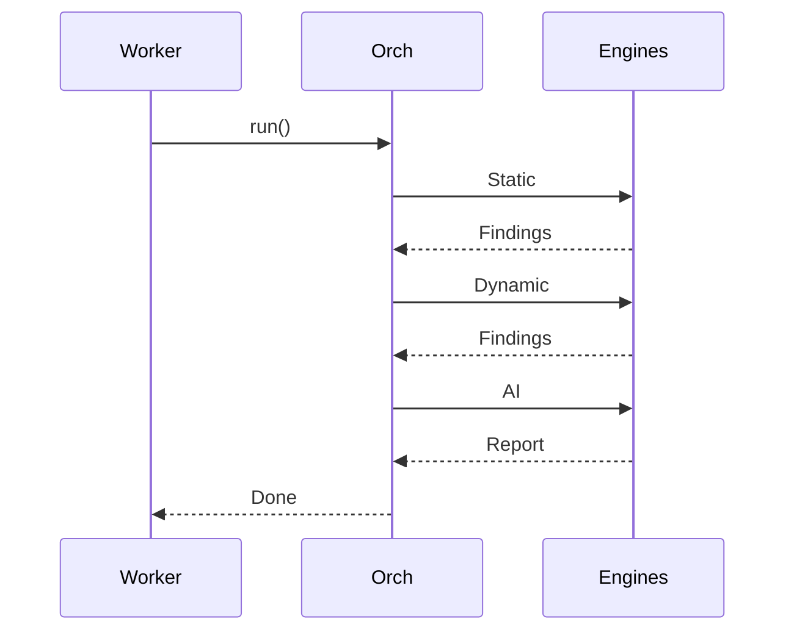
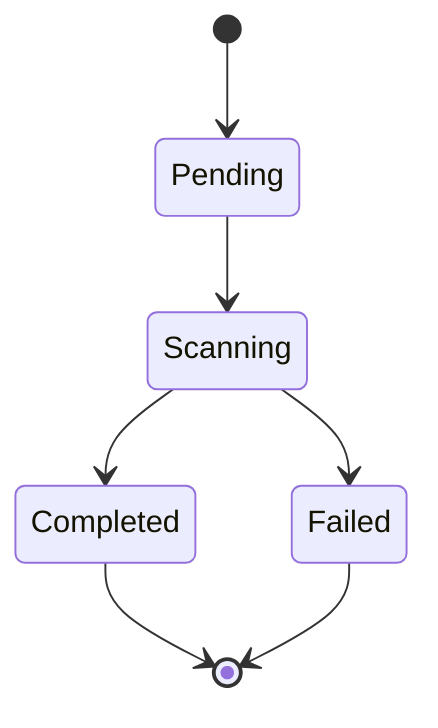

# Software Requirements Specification

  

# for

  

# Shinodroid

  

# Version 1.0.0

  

**Prepared by:** WORMHOLE Security

  

**Organization:** WORMHOLE // Shinodroid

  

**Date:** April 12, 2026

  

**Classification:** CONFIDENTIAL

  

**Standard:** ISO/IEC/IEEE 29148:2018

  

  

# Table of Contents

  

- ## **Revision History**

  

## 1. Introduction

  

  - 1.1 Purpose

  

  - 1.2 Document Conventions

  

  - 1.3 Intended Audience and Reading Suggestions

  

  - 1.4 Product Scope

  

  - 1.5 References

  

## 2. Overall Description

  

  - 2.1 Product Perspective

  

  - 2.2 Product Functions

  

  - 2.3 User Classes and Characteristics

  

  - 2.4 Operating Environment

  

  - 2.5 Design and Implementation Constraints

  

  - 2.6 User Documentation

  

  - 2.7 Assumptions and Dependencies

  

## 3. External Interface Requirements

  

  - 3.1 User Interfaces

  

  - 3.2 Hardware Interfaces

  

  - 3.3 Software Interfaces

  

  - 3.4 Communications Interfaces

  

## 4. System Features

  

  - 4.1 APK Ingestion and Validation

  

  - 4.2 Scan Lifecycle Management

  

  - 4.3 Engine Orchestration Pipeline

  

  - 4.4 Static Analysis Engines

  

  - 4.5 Dynamic Analysis Engines

  

  - 4.6 AI-Powered Security Triage

  

  - 4.7 Finding Persistence and Reporting

  

  - 4.8 Authentication and Authorization

  

  - 4.9 Real-Time Dashboard

  

## 5. Other Nonfunctional Requirements

  

  - 5.1 Performance Requirements

  

  - 5.2 Safety Requirements

  

  - 5.3 Security Requirements

  

  - 5.4 Software Quality Attributes

  

  - 5.5 Business Rules

  

## 6. Other Requirements

  

- **Appendix A: Glossary**

  

- **Appendix B: Analysis Models**

  

- **Appendix C: To Be Determined List**

  

  

## Revision History

  

- **Version 1.0.0** -- April 12, 2026 -- WORMHOLE Security Engineering -- Initial SRS release.

  

  

# 1. Introduction

  

## 1.1 Purpose

  

This Software Requirements Specification defines all functional and non-functional requirements for the Shinodroid platform, Version 1.0.0, developed by WORMHOLE Security. The document conforms to ISO/IEC/IEEE 29148:2018.

  

This SRS establishes the basis for agreement between WORMHOLE Security engineering and stakeholders on what the software product shall do. It defines the WHAT, not the HOW -- implementation approach is left to the developer unless a specific technology is listed as a constraint in Section 2.5.

  

This is the first release covering the v1.0.0 feature set. Planned v2.0.0 features appear only in the To Be Determined list (Appendix C).

  

## 1.2 Document Conventions

  

- The word **"shall"** indicates a mandatory requirement. The word **"should"** indicates a recommended but non-mandatory requirement.

- **FR-NNN** identifies a functional requirement. **NFR-NNN** identifies a non-functional requirement. **BR-NN** identifies a business rule.

- **Priority M** = Must Have (required for v1.0.0). **Priority S** = Should Have (important, not blocking). **Priority C** = Could Have (desirable if time permits).

- All requirement IDs are unique and traceable to use cases in Appendix B.5.

- Code identifiers, file names, and API endpoints appear in `monospace`.

- Higher-level requirements take precedence in case of conflict.

  

## 1.3 Intended Audience and Reading Suggestions

  

**Engineering Teams** shall read the entire document, focusing on Section 4 (System Features) and Section 3 (External Interfaces) for implementation scope.

  

**QA and Test Engineers** shall derive test cases from Section 4 functional requirements and Section 5 non-functional targets. Each requirement is written to be independently verifiable.

  

**Executive and Compliance Stakeholders** shall read Section 1.4 (Product Scope) for business context, Section 2.2 (Product Functions) for capability overview, and Section 5.5 (Business Rules) for operational policies.

  

**Security Auditors** shall review Section 5.3 (Security Requirements), Section 3.4 (Communications Interfaces) for trust boundaries, and Section 4.5-4.6 for the analysis pipeline.

  

**DevOps Engineers** shall focus on Section 2.4 (Operating Environment), Section 2.5 (Constraints), and Section 6 (Other Requirements) for deployment configuration.

  

## 1.4 Product Scope

  

  

The pipeline consists of static analysis (binary scanning, behavioral analysis, configuration auditing), dynamic analysis (runtime instrumentation, log capture), and AI-powered triage (finding prioritization, report generation). The system produces findings tagged with severity, CVSS v3.1 scores, and OWASP MASVS mappings. It generates professional PDF reports and persists all data in a real-time database.

  

**In scope for v1.0.0:**

  

- APK ingestion from three interfaces with binary-level validation

- Six analysis engines across five ordered phases

- Finding normalization with severity, CVSS, and OWASP MASVS mapping

- PDF, JSON, and Markdown report generation

- Real-time web dashboard with authentication

- Rate limiting, SSRF prevention, and row-level data isolation

  

**Out of scope for v1.0.0:**

  

- Penetration testing of live server infrastructure

- Modification, repacking, or redistribution of APK files

- Runtime Application Self-Protection (RASP) or continuous monitoring

- Public REST API for programmatic submission (see TBD-003)

- Network and SCA analysis engines (see TBD-001, TBD-002)

  

**Business objectives:**

  

1. Reduce time from APK submission to vulnerability report from 3-7 business days (industry average for manual review) to under 60 minutes for automated phases.

2. Enable organizations without dedicated mobile AppSec teams to perform OWASP MASVS-mapped security assessments.

3. Produce audit-ready PDF reports suitable for compliance documentation and client delivery.

  

## 1.5 References

  

- REF-01: ISO/IEC/IEEE 29148:2018 -- Systems and software engineering -- Life cycle processes -- Requirements engineering

- REF-02: OWASP Mobile Application Security Verification Standard (MASVS) v2.0

- REF-03: OWASP Mobile Top 10 (2024)

- REF-04: CVSS v3.1 Specification (FIRST.org)

- REF-05: MobSF v4.4.5 REST API Documentation

- REF-06: Frida 16.7.19 Documentation

- REF-07: Convex 1.32.0 SDK and API Documentation

- REF-08: Next.js 16.1.6 Framework Documentation

- REF-09: Ollama REST API Specification

- REF-11: Android Debug Bridge (ADB) Command Reference

  

  

# 2. Overall Description

  

## 2.1 Product Perspective

  

Shinodroid is a new, standalone product. It does not replace or extend any predecessor system. The system coordinates multiple open-source analysis tools and a locally-hosted AI inference model into a unified security workflow.

  

  

## 2.2 Product Functions

  

- **F-02 Scan Lifecycle:** The system shall track each scan through defined states -- pending, scanning, completed, failed -- and push state changes to connected clients within 2 seconds.

- **F-03 Engine Orchestration:** The system shall discover and execute registered analysis engines in a fixed phase order, isolating failures so that one engine crash does not terminate the pipeline.

- **F-04 Static Analysis:** The system shall analyze APK binaries for permissions, vulnerabilities, hardcoded secrets, behavioral risks, and cloud service misconfigurations without executing the application.

- **F-05 Dynamic Analysis:** The system shall install the APK on an emulator, instrument its runtime behavior to detect security bypass mechanisms, and capture runtime log output for sensitive data leakage.

- **F-06 AI Triage:** The system shall aggregate all findings from previous phases and submit them to a locally-hosted LLM for prioritized, OWASP-mapped security analysis and report generation.

- **F-07 Report Generation:** The system shall produce JSON, Markdown, and PDF reports per scan and store them for authenticated download.

- **F-08 Finding Persistence:** The system shall persist normalized findings with severity rating, CVSS score, OWASP mapping, and engine attribution.

- **F-09 Web Dashboard:** The system shall provide a real-time web interface for scan submission, status monitoring, finding review, and report download.

- **F-10 Security Controls:** The system shall enforce authentication, row-level data isolation, rate limiting, SSRF prevention, and path traversal protection.

  

## 2.3 User Classes and Characteristics

  

  

**DevSecOps Engineer (Secondary User):** Frequency: weekly. Technical level: expert. Deploys platform, configures pipeline, monitors engine health, integrates CI/CD. Uses Docker Compose, environment variables, and folder-drop automation. Requires plugin architecture and env-driven configuration.

  

**Executive / Compliance Officer (Tertiary User):** Frequency: monthly. Technical level: non-technical. Reviews PDF reports for risk posture and compliance status. Requires executive summary and severity charts. Does not interact with technical finding details.

  

**CI/CD Pipeline (Non-Human Actor):** Frequency: per-build. Submits APKs via folder-drop. Consumes report artifacts from the output directory. Requires no interactive interface.

  

## 2.4 Operating Environment

  

**Host Operating System:** Windows 10/11 (primary target) or Linux x86_64. macOS for local development only.

  

**Runtime:** Node.js >= 22.0.0 with ESM module support.

  

**Frontend:** Next.js 16.1.6 with React 19.2.3, served on port 3000.

  

**Backend Services:** Convex BaaS 1.32.0 (cloud-hosted), MobSF v4.4.5 (containerized, port 8000), Ollama with `minimax-text-01:cloud` (host-installed, port 11434), Android Emulator / BrutDroid 2.0.

  

**Containerization:** Docker Compose production deployment with three containers: web (2 GB RAM, 2 CPU), worker (2 GB RAM, 2 CPU), MobSF (3 GB RAM, 2 CPU).

  

**Minimum Hardware:** 16 GB RAM, 8 vCPUs, 100 GB SSD.

  

## 2.5 Design and Implementation Constraints

  

These constraints are technology mandates that limit developer choice. They are listed here, not in individual requirements, to separate the WHAT (requirements) from the HOW (constraints).

  

- CON-01: All backend modules shall use ESM format (`.mjs` extension, `import`/`export`).

- CON-02: The static analysis tool shall be MobSF v4.4.5 accessed via REST API.

- CON-03: AI inference shall use Ollama hosting `minimax-text-01:cloud` locally. No external LLM API calls (data sovereignty).

- CON-04: PDF generation shall use headless Chromium browser automation.

- CON-05: The frontend shall be built with Next.js 16.1.6 and React 19.2.3.

- CON-06: Convex 1.32.0 shall be the exclusive persistence, auth, and real-time backend.

- CON-07: Production deployment shall use Docker Compose. Kubernetes is out of scope for v1.0.0.

- CON-08: All secrets shall be managed via environment variables. No credentials in source tree.

- CON-09: Docker containers shall run as non-root users with `no-new-privileges` security option.

- CON-10: Dynamic instrumentation shall use Frida 16.7.19 via CLI.
- CON-11: The rate limiter shall use in-memory storage in v1.0.0. Rate limit counters reset on worker process restart and are not shared across multiple instances (see TBD-008).

  

## 2.6 User Documentation

  

- **README.md:** Installation prerequisites, setup steps, environment variable reference, quick-start guide.

- **ARCHITECTURE.md:** Component inventory, data flow, security model, engine interface contract.

- **Inline JSDoc:** All exported functions in engine modules and the orchestrator include parameter types, return types, and behavior descriptions.

- **Per-Scan Reports:** Each completed scan produces a self-contained Markdown and PDF report documenting methodology, findings, and remediation guidance.

  

## 2.7 Assumptions and Dependencies

  

**Assumptions:**

  

- ASM-01: Submitted APK files are syntactically valid Android packages (ZIP format, `PK\x03\x04` magic bytes).

- ASM-02: Users have legal authorization to analyze submitted applications.

- ASM-03: An Android Virtual Device is pre-configured and running before dynamic analysis phases execute. The system does not provision AVDs in v1.0.0.

- ASM-04: The AI inference model is pre-installed and available at the configured endpoint.

- ASM-05: Python 3.x and behavioral analysis tool dependencies are installed on the host.

- ASM-06: Docker bridge networking provides inter-container connectivity.

  

**External Dependencies (with failure impact):**

  

- **Convex BaaS 1.32.0 (Critical):** If unavailable, the system is entirely inoperative. No persistence, no auth, no real-time updates.

- **MobSF v4.4.5 (Critical):** If unavailable, scans shall fail. MobSF is the only mandatory analysis engine.

- **Ollama + minimax-text-01:cloud (Non-Critical):** If unavailable, the AI report shall be skipped. Static and dynamic reports shall still be generated.

- **Android Emulator (Non-Critical):** If unavailable, dynamic analysis shall be skipped. Static reports shall still be generated.

- **Frida 16.7.19 (Non-Critical):** If unavailable, instrumentation shall be skipped.

  

  

# 3. External Interface Requirements

  

## 3.1 User Interfaces

  

### 3.1.1 Web Dashboard

  

The system shall provide a web application on port 3000 as the primary user interface.

  

**Landing Page:** The system shall display a publicly accessible page that does not require authentication. The page shall present product capabilities, statistics, and pricing. The page shall load within 3 seconds on a 20 Mbps connection as measured by Lighthouse. Detailed visual design is specified in a separate UI Design Specification.

  

**Authentication Pages:** The system shall provide login and signup pages using email/password. Verification: successful login redirects to dashboard within 1 second.

  

**Main Dashboard:** The system shall display scan cards showing status, filename, timestamp, and severity donut charts. The system shall update scan status within 2 seconds of backend change without page refresh. Verification: measured via WebSocket latency.

  

**Scan Submission:** The system shall provide drag-and-drop file upload with client-side validation of extension and size before upload begins. Verification: invalid file rejected within 500ms with descriptive error.

  

**Scan Detail:** The system shall display findings filterable by severity, category, and engine, with download buttons for all report types. Verification: filter applies within 200ms.

  

**Responsiveness:** The system shall be fully functional on screen resolutions >= 1024x768.

  

### 3.1.3 Folder-Drop Interface

  

The system shall monitor a configurable filesystem directory for new file additions. The system shall detect, validate, and submit new APK files for scanning within 10 seconds of file creation. Reports shall be written to a configurable output directory. No interactive UI shall be presented.

  

## 3.2 Hardware Interfaces

  

- **Android Emulator:** The system shall communicate with the emulator via ADB over TCP. The `adb` binary shall be in the system PATH.

- **Host Filesystem:** The system shall read/write to a temporary staging directory and a report output directory.

- **Network Adapter:** The system shall use loopback (`127.0.0.1`) for all inter-service communication between worker, static analysis, and AI inference services.

  

## 3.3 Software Interfaces

  

- **Convex BaaS:** The system shall use the Convex SDK (REST + WebSocket) for database operations, real-time subscriptions, file storage, and authentication.

- **MobSF:** The system shall call `POST /api/v1/upload`, `/scan`, `/report_json`, and `/download_pdf` endpoints, authenticated via API key header.

- **Ollama:** The system shall call `POST /api/chat` with model name, messages array, and generation parameters (`temperature`, `num_predict`).

- **Frida:** The system shall invoke the `frida` CLI as a subprocess using USB transport (`-U` flag).

- **ADB:** The system shall invoke the `adb` CLI for APK installation and log capture.

- **Androwarn:** The system shall invoke the Androwarn Python CLI as a subprocess and parse its JSON output.

  

## 3.4 Communications Interfaces

  

- **Browser to Dashboard:** HTTPS/WSS on port 3000. TLS terminated by reverse proxy in production.

- **Worker to MobSF:** HTTP on port 8000. Loopback only. Blocked from external access by firewall.

- **Worker to Ollama:** HTTP on port 11434. Loopback only. Blocked from external access.

- **Worker to Convex:** HTTPS/WSS on port 443. TLS enforced by Convex.

- **Worker to ADB:** TCP on port 5037. Loopback only. Blocked from external access.

- **ADB to Emulator:** TCP on ports 5554-5585. Loopback only. Blocked from external access.

- **Frida to Emulator:** TCP on port 27042. Loopback only. Blocked from external access.

  

All internal ports (8000, 5037, 27042, 5554-5585, 11434) shall be restricted to loopback access via host firewall rules. Only port 3000 shall accept external connections.

  

  

# 4. System Features

  

Each feature includes a description, stimulus/response sequences, and functional requirements written in "shall" form. Every requirement is assigned a unique ID and priority.

  

## 4.1 APK Ingestion and Validation

  

### 4.1.1 Description and Priority

  

Priority: Must Have. This feature is the entry point for all system workflows. The system shall accept mobile application binaries, validate them, and create scan records.

  

### 4.1.2 Stimulus/Response Sequences

  

- **Stimulus:** User uploads APK via dashboard.

  **Response:** The system shall validate the file and create a scan record within 5 seconds. The system shall return the scan ID and redirect to the detail page.

  

  **Response:** The system shall validate the sender and file, then reply with a confirmation message within 5 seconds.

  

- **Stimulus:** File appears in the watched directory.

  **Response:** The system shall detect and begin processing the file within 10 seconds.

  

- **Stimulus:** User submits an invalid file (wrong type, bad binary header, or oversized).

  **Response:** The system shall reject the file with a descriptive error message. No scan record shall be created. No analysis shall be performed.

  

### 4.1.3 Functional Requirements

  

**FR-001** (M) The system shall allow authenticated users to upload a mobile application binary via drag-and-drop or file browser. Verification: upload a 50 MB test APK; scan record appears within 5 seconds.

  

  

**FR-003** (S) The system shall detect new files in the configured inbox directory within 10 seconds and automatically submit valid files for scanning. Verification: place test APK in directory; scan initiates within 10 seconds.

  

**FR-004** (M) The system shall reject any file whose extension is not in the set `.apk`, `.xapk`, `.appx`, `.apks`. The system shall also reject any file whose first 4 bytes do not match ZIP magic bytes `PK\x03\x04` (hex `50 4B 03 04`). Verification: submit `test.exe`; verify rejection. Rename PNG to `.apk`; verify binary rejection.

**FR-004a** (S) When a `.ipa` file is submitted, the system shall route it to the static analysis engine only and skip all dynamic analysis phases. The scan report shall note "iOS -- Dynamic analysis not available in v1.0.0." Verification: submit test IPA; verify static-only scan and disclaimer in report. (See also TBD-009.)

  

**FR-005** (M) The system shall reject any file exceeding 100 MB (100,000,000 bytes) at both the client upload layer and the server processing layer. Verification: attempt 150 MB upload; verify rejection at client before transfer begins.

  

## 4.2 Scan Lifecycle Management

  

### 4.2.1 Description and Priority

  

Priority: Must Have. The system shall track each APK from submission through analysis to report delivery using a defined state machine.

  

### 4.2.2 Stimulus/Response Sequences

  

- **Stimulus:** Valid APK accepted by any ingestion path.

  **Response:** Scan record created with status `pending`.

  

- **Stimulus:** Worker detects pending scan during polling cycle.

  **Response:** Status updated to `scanning`. APK downloaded. Pipeline started.

  

- **Stimulus:** All engines complete without critical failure.

  **Response:** Findings persisted. Reports uploaded. Status set to `completed` with timestamp.

  

- **Stimulus:** Critical engine (MobSF) unavailable.

  **Response:** Status set to `failed`. Sanitized error message stored. No internal details exposed.

  

### 4.2.3 Functional Requirements

  

**FR-006** (M) The system shall create a scan record containing user ID, file name, file size, and status `pending` upon successful file validation. Verification: query database after upload; confirm record exists with correct fields.

  

**FR-007** (M) The system shall enforce the state machine: `pending` -> `scanning` -> `completed` or `failed`. The system shall record a `completedAt` timestamp on terminal states. The system shall not allow backward transitions. Verification: attempt direct update from `completed` to `scanning`; verify rejection.

  

**FR-008** (M) The system shall poll for pending scans at a configurable interval (default: 30 seconds). Verification: create pending scan; confirm worker picks it up within one polling interval.

  

**FR-009** (M) The system shall reject new scan submissions from any user who has 3 or more scans in `pending` or `scanning` status. Verification: create 3 scans; submit 4th; verify rejection with descriptive error.

  

**FR-010** (M) The system shall delete all temporary files (downloaded APK, intermediate artifacts) from the staging directory after scan completion or failure, regardless of the exit path. Verification: verify staging directory is empty after scan completes.

  

**FR-011** (M) The system shall remove stack traces, absolute file paths, and internal module names from error messages before persisting them. Verification: trigger deliberate engine error; verify stored message contains no path or trace.

  

**FR-012** (S) The system shall retry with exponential backoff when the database connection fails. The system shall halt polling and log a critical alert after 3 consecutive failures. Verification: simulate 3 timeouts; verify polling stops and alert is logged.

  

  

## 4.3 Engine Orchestration Pipeline

  

### 4.3.1 Description and Priority

  

Priority: Must Have. The system shall discover, validate, and execute analysis engines in a fixed phase order with fault isolation between engines.

  

### 4.3.2 Stimulus/Response Sequences

  

- **Stimulus:** Worker invokes pipeline execution with APK path and scan context.

  **Response:** The system shall import all engine modules, check availability, execute in phase order, and return aggregated results.

  

- **Stimulus:** An engine throws an unhandled exception during execution.

  **Response:** The system shall catch the error, log it, mark the engine as failed, and continue with the remaining engines. The pipeline shall not terminate.

  

### 4.3.3 Functional Requirements

  

**FR-013** (M) The system shall automatically discover engine modules from a designated directory by importing files that match the naming convention. The system shall validate that each module exports the required interface: `name`, `type`, `version`, `isAvailable()`, and `run()`. Verification: add a conforming module; verify auto-detection without configuration changes.

  

**FR-014** (M) The system shall call `isAvailable()` on each engine before execution. Engines returning false shall be skipped with a logged warning. Verification: mock engine returning false; verify skip and log entry.

  

**FR-015** (M) The system shall execute engines in strict phase order: Phase 1 (static -- parallel), Phase 2 (dynamic -- sequential), Phase 3 (network -- reserved), Phase 4 (SCA -- reserved), Phase 5 (AI -- last). The system shall not begin Phase N+1 until Phase N completes. Verification: measure timestamps; confirm Phase 2 starts only after Phase 1 finishes.

  

**FR-016** (M) The system shall isolate each engine execution so that an unhandled exception in one engine does not affect any other engine. Verification: inject fault into one engine; verify all other engines execute and return results.

  

**FR-017** (M) The system shall require all engines to return results in a standardized schema containing: finding title, severity (critical/high/medium/low/info), numeric severity order, category, description, recommendation, CVSS score, and OWASP category. Verification: submit engine result missing required field; verify rejection.

  

## 4.4 Static Analysis Engines

  

### 4.4.1 Description and Priority

  

Priority: Must Have. Three engines shall run in parallel during Phase 1, each covering a different analysis domain.

  

### 4.4.2 Functional Requirements

  

**FR-018** (M) The system shall upload the APK to the static analysis service, trigger a scan, and retrieve both JSON and PDF reports. All HTTP requests to this service shall timeout after 180 seconds. Verification: scan a known test APK (DIVA); verify >= 5 findings returned within timeout.

  

**FR-019** (M) The system shall invoke a behavioral analysis tool to detect telephony abuse, GPS access, device information leakage, and other behavioral risk indicators. Verification: scan APK with known telephony permission; verify corresponding finding generated.

  

**FR-020** (M) The system shall scan APK contents for cloud service misconfigurations, including open database rules and hardcoded API keys. Verification: scan APK with known Firebase misconfiguration; verify finding generated.

  

## 4.5 Dynamic Analysis Engines

  

### 4.5.1 Description and Priority

  

Priority: Must Have. Dynamic engines shall run sequentially during Phase 2 on the emulator.

  

### 4.5.2 Functional Requirements

  

**FR-021** (M) The system shall install the APK on the emulator using `adb install -r -t`. The `-r` flag permits reinstallation. The `-t` flag permits test packages. The system shall verify installation success via exit code 0. Verification: install test APK; verify package appears in `adb shell pm list packages`.

  

**FR-022** (M) The system shall inject an SSL/TLS certificate pinning bypass script covering at least 30 bypass methods (TrustManager, OkHTTP, Conscrypt, Flutter, Cronet). The system shall report each pinning mechanism detected and bypassed. Verification: test against app with known OkHTTP pinning; verify bypass reported.

  

**FR-023** (M) The system shall inject a root detection bypass script hooking at least 25 package name checks and 7 binary path checks. The system shall report each detection mechanism found. Verification: test against app with known root detection; verify bypass finding.

  

**FR-024** (S) The system shall execute a suite of security module scripts covering authentication, cryptography, network security, platform security, resilience, and data storage instrumentation. Verification: run against test APK; verify >= 1 finding from each module that detects a hook.

  

**FR-025** (M) The system shall capture Android runtime logs and filter them for: credentials in plain text, personally identifiable information, authentication tokens, API keys, cryptographic material, and internal IP addresses. Verification: run APK that logs a hardcoded password; verify finding generated.

  

  

## 4.6 AI-Powered Security Triage

  

### 4.6.1 Description and Priority

  

Priority: Must Have. The AI engine shall run last (Phase 5) and receive all findings from previous phases. It shall produce a structured Markdown report and convert it to PDF.

  

### 4.6.2 Stimulus/Response Sequences

  

- **Stimulus:** Phases 1-4 complete with at least one finding.

  **Response:** The system shall aggregate, deduplicate, and batch findings, submit them to the AI service, and generate reports.

  

- **Stimulus:** AI inference service is unavailable.

  **Response:** The system shall skip AI report generation and complete the scan with static/dynamic reports only. The scan shall not fail.

  

- **Stimulus:** Phases 1-4 produce zero findings.

  **Response:** The system shall skip AI analysis (no input) and mark the AI engine as skipped.

  

### 4.6.3 Functional Requirements

  

**FR-026** (M) The system shall deduplicate findings by title and engine and sort by severity descending. The system shall batch findings into groups of no more than 20 per inference request. Verification: submit 50 findings with 10 duplicates; verify 40 unique findings in 2 batches.

  

**FR-027** (M) The system shall generate a Markdown report containing: executive summary, per-finding analysis with exploit scenarios, OWASP MASVS compliance mapping, and remediation roadmap. Verification: inspect AI report output; confirm all four sections present.

  

**FR-028** (M) The system shall convert the Markdown report to a PDF file. Verification: open generated PDF; confirm it is a valid, non-zero-byte PDF with rendered content.

  

**FR-029** (M) The system shall complete the scan normally if the AI service is unavailable. AI report fields shall be set to null. The scan status shall be `completed`, not `failed`. Verification: stop AI service; run scan; verify `completed` status with null AI report fields.

  

## 4.7 Finding Persistence and Reporting

  

### 4.7.1 Description and Priority

  

Priority: Must Have. All findings shall be persisted and all reports shall be stored for authenticated retrieval.

  

### 4.7.2 Functional Requirements

  

**FR-030** (M) The system shall insert findings into the database in batches of 50 per write operation. Verification: generate 200 findings; verify 4 batch inserts in logs.

  

**FR-031** (M) The system shall cap findings at 2,000 per scan. If the total exceeds 2,000, the system shall sort by severity, keep the top 2,000, discard the rest, and log a warning with the discarded count. Verification: generate 2,500 findings; verify 2,000 stored and warning logged.

  

**FR-032** (M) The system shall update the scan record with counts of findings per severity level (critical, high, medium, low, info) upon completion. Verification: verify severity counts in scan record match actual finding counts.

  

**FR-033** (M) The system shall upload generated report files to cloud storage and record the storage identifiers in the scan record. Verification: verify storage IDs are non-null after successful scan.

  

**FR-034** (M) The system shall allow authenticated users to download reports only for scans they own. The system shall verify user ID matches the scan's owner before generating a download URL. Verification: attempt to download another user's report; verify rejection. Note: FR-035 through FR-043 are assigned in Sections 4.8 and 4.9. The following requirements were identified during report artifact analysis and logically belong to this feature.

**FR-044** (M) The system shall save the raw static analysis JSON response as a file. Verification: verify file exists and contains valid JSON.

**FR-045** (M) The system shall save combined dynamic analysis results as a JSON file. Verification: verify file exists after dynamic analysis.

**FR-046** (M) The system shall include an OWASP MASVS compliance mapping section in the AI-generated report. Verification: inspect report; confirm MASVS identifiers present.

  

## 4.8 Authentication and Authorization

  

### 4.8.1 Description and Priority

  

Priority: Must Have. All scan data shall be user-scoped. No user shall access another user's scans or findings.

  

### 4.8.2 Functional Requirements

  

**FR-035** (M) The system shall allow new users to create accounts using email and password. Verification: register new user; verify login succeeds.

  

**FR-036** (M) The system shall authenticate users via email and password and return a session token. Verification: login with valid credentials; verify token returned.

  

**FR-037** (M) The system shall verify that the authenticated user's ID matches the record owner's ID on every data query and mutation. The system shall return null or HTTP 403 on mismatch. Verification: User A queries User B's scan by ID; verify null or 403 returned.

  

**FR-038** (M) The system shall enforce a rate limit of 60 requests per minute per client IP address. The system shall return HTTP 429 when the limit is exceeded. Verification: send 61 requests in 1 minute from same IP; verify 429 on the 61st.

  

**FR-039** (M) The system shall validate that the static analysis service URL resolves to a loopback IP address (`127.0.0.0/8` or `::1`). The system shall refuse to start if the URL resolves to any external IP. Verification: set URL to `http://evil.com`; verify startup failure with SSRF error.

  

## 4.9 Real-Time Dashboard

  

### 4.9.1 Description and Priority

  

Priority: Must Have (core dashboard).

  

### 4.9.2 Functional Requirements

  

**FR-040** (M) The system shall push scan status changes to all subscribed clients within 2 seconds of the backend state change, without requiring page refresh. Verification: measure time between mutation and UI update; verify <= 2 seconds for 95% of events.

  

**FR-041** (S) The system shall render a functional landing page with or without WebGL support. If the browser supports WebGL, enhanced visuals shall be displayed. If not, the system shall render a non-WebGL fallback with no JavaScript errors. Verification: load page in browser without WebGL; verify no errors and content displayed.

  

**FR-042** (M) The system shall display all findings for a scan in a list that is filterable by severity, category, and engine, and sortable by severity order. Verification: apply severity filter; verify only matching findings shown.

  

**FR-043** (C) The system shall expose 7 plugin tools for static analysis interaction: `upload` (submit APK), `scan` (trigger analysis), `report` (retrieve JSON), `scans` (list scans), `pdf` (download PDF), `scorecard` (retrieve score), `auto_scan` (upload + scan in one call). Verification: invoke each tool; verify expected JSON or PDF response.

  

  

# 5. Other Nonfunctional Requirements

  

## 5.1 Performance Requirements

  

- **NFR-001** The system shall complete a full analysis pipeline for an APK file <= 50 MB within 45 minutes, measured from status `scanning` to status `completed`, for 90% of scans when operating with <= 10 concurrent scans and <= 50 concurrent dashboard users.

- **NFR-002** The web dashboard shall achieve a Time-to-Interactive of <= 3 seconds on a 20 Mbps connection, as measured by Lighthouse.

- **NFR-003** Scan status changes shall propagate to subscribed clients within 2 seconds for 95% of events when serving <= 50 concurrent dashboard users.

- **NFR-004** The worker container shall not exceed 2 GB RAM usage during any single scan, as measured by `docker stats`.

- **NFR-005** All HTTP requests to the static analysis service shall timeout after 180 seconds.

- **NFR-006** The system shall reject any HTTP response body exceeding 20 MB (20,971,520 bytes).

- **NFR-007** The dashboard shall support 50 concurrent authenticated users with P95 response time no more than 20% above the single-user baseline.

  

## 5.2 Safety Requirements

  

- **NFR-008** The system shall perform runtime instrumentation exclusively on isolated emulators. The system shall not connect to or modify any physical user device.

- **NFR-009** All AI-generated reports shall include the disclaimer: "This analysis is generated by an automated AI system. Findings require validation by a qualified security professional before use in legal, compliance, or contractual proceedings." (See also BR-05.)

- **NFR-010** The system shall not retain APK binary files beyond the scan lifecycle. APK files shall be deleted from the staging directory upon scan completion or failure (per FR-010).

  

## 5.3 Security Requirements

  

- **NFR-011** All dashboard pages except the landing page, login page, and signup page shall require authentication. Unauthenticated requests to protected pages shall be redirected to the login page.

- **NFR-012** All credentials, API keys, and deploy keys shall be stored exclusively in environment variables. The source tree shall contain zero hardcoded secrets. Verification: run secret scanning tool; verify zero findings.

- **NFR-013** All Docker containers shall run as non-root users with the `no-new-privileges:true` security option. Verification: `docker inspect` confirms for all three containers.

- **NFR-014** Ports 8000, 5037, 27042, and 5554-5585 shall be blocked from external network access. Verification: external port scan returns filtered or closed for all listed ports.

- **NFR-015** The system shall reject any file path containing `..` (dot-dot) sequences in all file handling contexts. Verification: submit filename `../../etc/passwd.apk`; verify rejection.

- **NFR-016** The system shall not include stack traces, absolute file paths, or internal implementation details in any error message returned to users, stored in the database, or displayed in the UI.

- **NFR-017** All external-facing HTTP traffic shall use TLS 1.2 or higher in production deployment. Verification: SSL Labs scan returns grade A.
- **NFR-028** The system shall not transmit APK binary content or extracted findings to any third-party service. All analysis shall be performed on infrastructure under the operator's control. Verification: capture network traffic during scan; verify no outbound connections to external analysis services.
- **NFR-029** The system shall allow authenticated users to permanently delete their scan records, associated findings, and uploaded files. Verification: delete scan; verify record, findings, and storage files are removed.

  

## 5.4 Software Quality Attributes

  

**Maintainability:**

  

- **NFR-018** Adding a new analysis engine shall require only creating a new module file with the correct exports and assigning it to a pipeline phase. No modifications to the orchestrator shall be necessary. Verification: add test engine; verify discovery without orchestrator changes.

- **NFR-019** At least 80% of exported functions in engine modules and the orchestrator shall have JSDoc documentation covering parameters, return types, and behavior. Verification: measure JSDoc coverage.

- **NFR-020** All deployment-specific parameters shall be configurable via environment variables. Verification: verify each environment variable listed in Section 6.2 is functional when set.

  

**Reliability:**

  

- **NFR-021** Failure of any non-critical engine (any engine except MobSF) shall not cause the scan to fail. The scan shall complete with findings from successful engines. Verification: disable Frida engine; verify scan completes with static findings.

- **NFR-022** Scan records and findings shall survive worker process restart. Verification: kill worker mid-scan; restart; verify pending scan is re-processed.

- **NFR-023** The worker shall recover from transient database connectivity failures using automatic retry with exponential backoff. Verification: simulate 2 consecutive timeouts; verify worker recovers.

  

**Availability:**

  

- **NFR-024** The web dashboard shall be available 99.5% of each calendar month (maximum 3.65 hours downtime per month). Verification: measured via uptime monitoring; health check endpoint shall respond within 500ms for 99% of probes during a 4-hour stress test.

- **NFR-025** Docker health checks shall verify: HTTP 200 on root URL `/` for web and MobSF containers, process liveness for worker container. Verification: `docker inspect` shows `healthy` status.

  

**Portability:**

  

- **NFR-026** The production system shall deploy via `docker compose up` on x86_64 Linux or Windows and shall be functional within 10 minutes of initial pull. Verification: fresh deploy on clean host; measure time to first successful scan submission.

- **NFR-027** Local development shall function on Windows, macOS, and Linux with Node.js >= 22 using two commands. Verification: `npm run dev` + `node supabase-worker.mjs` on each OS. Note: The worker filename `supabase-worker.mjs` is a legacy name retained from an earlier project phase; the module communicates with Convex, not Supabase.

  

## 5.5 Business Rules

  

- **BR-01** Each user shall have at most 3 concurrent active scans (sum of `pending` + `scanning` status).

- **BR-02** Individual APK file submissions shall not exceed 100 MB.

- **BR-03** API access shall be rate-limited to 60 requests per minute per client IP address.

- **BR-04** Scan results shall be scoped to the submitting user. No user shall access another user's scans, findings, or reports.

- **BR-05** AI-generated security analysis is advisory only. WORMHOLE Security assumes no liability for missed vulnerabilities, false positives, or actions taken based on AI recommendations. (See also NFR-009.)
- **BR-07** Scan data shall be retained until the user explicitly deletes it. Operators may configure data retention policies outside the application via database-level TTL rules.

- **BR-06** The platform shall only be used to analyze applications for which the submitting user has obtained legal authorization.

  

  

# 6. Other Requirements

  

## 6.1 Data Requirements and Logical Schema

The following defines the logical data model required by the system. Physical implementation uses Convex document tables. Index definitions are provided for reference and are subject to performance tuning.

  

### Scans Table

  

- `_id` (auto) -- Document identifier

- `_creationTime` (auto) -- Creation timestamp

- `userId` (required) -- Owner user reference

- `fileName` (required) -- Original APK filename

- `filePath` (required) -- Logical storage path

- `fileSize` (required) -- File size in bytes

- `status` (required) -- One of: `pending`, `scanning`, `completed`, `failed`

- `scanType` (optional) -- Scan classification

- `findingsCritical` (required, default 0) -- Critical severity count

- `findingsHigh` (required, default 0) -- High severity count

- `findingsMedium` (required, default 0) -- Medium severity count

- `findingsLow` (required, default 0) -- Low severity count

- `findingsInfo` (required, default 0) -- Info severity count

- `reportJson` (optional) -- Inline static analysis JSON

- `errorMessage` (optional) -- Sanitized error message

- `storageId` (optional) -- APK storage identifier

- `reportStorageId` (optional) -- Static PDF storage identifier

- `dynamicReportStorageId` (optional) -- Dynamic report storage identifier

- `aiReportStorageId` (optional) -- AI PDF storage identifier

- `completedAt` (optional) -- Terminal state timestamp

  

**Indexes:** `by_userId [userId]`, `by_status [status]`, `by_userId_status [userId, status]`

  

### Findings Table

  

- `_id` (auto) -- Document identifier

- `_creationTime` (auto) -- Creation timestamp

- `scanId` (required) -- Parent scan reference

- `title` (required) -- Finding title

- `severity` (required) -- One of: `critical`, `high`, `medium`, `low`, `info`

- `severityOrder` (required) -- Numeric sort value: 5, 4, 3, 2, 1

- `category` (required) -- Finding category

- `description` (optional) -- Technical evidence and detail

- `recommendation` (optional) -- Remediation guidance

- `cvssScore` (optional) -- CVSS v3.1 base score (0.0-10.0)

- `owaspCategory` (optional) -- OWASP Mobile Top 10 category

  

**Indexes:** `by_scanId [scanId]`, `by_severity [severityOrder]`

  

Note: The in-memory Finding interface includes transient fields `owasp_masvs` and `engine` used during pipeline execution. These fields are not persisted to the database. The `engine` field is used for deduplication; `owasp_masvs` is consumed by the AI engine for report generation.

  

### Auth Tables

  

The auth backend manages four tables: `users` (accounts), `sessions` (active sessions), `accounts` (provider links), `verificationTokens` (email verification and password reset).

  

### Data Constraints

  

- DC-01: `severityOrder` shall match `severity` (critical=5, high=4, medium=3, low=2, info=1).

- DC-02: `scans.userId` shall reference a valid user document.

- DC-03: `findings.scanId` shall reference a valid scan document.

- DC-04: `scans.status` shall be one of the four enumerated values.

- DC-05: Total findings per scan shall not exceed 2,000.

- DC-06: `scans.fileSize` shall be a positive integer not exceeding 100,000,000.

  

## 6.2 Environment Configuration

  

- `MOBSF_API_KEY` (required) -- Static analysis service API key

- `CONVEX_DEPLOY_KEY` (required) -- Database deployment key for worker authentication

- `MOBSF_URL` (default `http://127.0.0.1:8000`) -- Static analysis base URL (loopback enforced)

- `OLLAMA_BASE_URL` (default `http://127.0.0.1:11434`) -- AI inference server URL

- `OLLAMA_MODEL` (default `minimax-text-01:cloud`) -- AI model identifier (run `ollama pull minimax-text-01:cloud` before first use)

- `APK_INBOX_DIR` (default `C:\MobSF-Scans\inbox`) -- Folder-drop watch directory

- `REPORTS_OUTPUT_DIR` (default `C:\MobSF-Scans\reports`) -- Report output directory

- `POLL_INTERVAL_MS` (default `30000`) -- Worker polling interval in milliseconds

  

  

# Appendix A: Glossary

  

- **APK** -- Android Package Kit, the binary distribution format for Android apps

- **AbortController** -- Web API for canceling HTTP requests after a timeout period

- **ADB** -- Android Debug Bridge, command-line tool for emulator/device communication

- **BaaS** -- Backend-as-a-Service, the managed database and auth pattern used by this system

- **BrutDroid** -- Android emulator management tool (v2.0)

- **CVSS** -- Common Vulnerability Scoring System, rates severity on a 0.0-10.0 scale

- **Engine** -- A self-contained analysis module conforming to the standard interface contract

- **Finding** -- A discrete security issue identified by an engine, stored in the standard schema

- **Frida** -- Open-source dynamic instrumentation framework for runtime analysis

- **Finding Schema** -- Standardized data structure for security issues: title, severity, CVSS, OWASP category, description, recommendation

- **LLM** -- Large Language Model, the AI model used for security triage

- **Magic Bytes** -- First bytes of a file identifying its format (APK/ZIP: `PK\x03\x04`)

- **MASVS** -- OWASP Mobile Application Security Verification Standard

- **MobSF** -- Mobile Security Framework, open-source static analysis tool

- **Orchestrator** -- The module that discovers, orders, and executes analysis engines

- **Scan** -- A complete lifecycle event from APK submission to report generation

- **SHINOBI Suite** -- Six specialized instrumentation scripts (AUTH, CRYPTO, NETWORK, PLATFORM, RESILIENCE, STORAGE)

- **SSL-BYE.js** -- Instrumentation script with 30+ SSL/TLS pinning bypass methods (729 lines)

- **ROOTER.js** -- Instrumentation script for root detection bypass (342 lines)

- **Worker** -- Background process that polls for pending scans and executes the pipeline

  

  

# Appendix B: Analysis Models

  

## B.1 System Architecture

  

![[mermaid-diagram-2026-04-13-002846 1.png]]

  

## B.2 Pipeline Sequence

  

  

Before calling `run()`, the Worker polls the database for pending scans, downloads the APK, and sets status to `scanning`. After receiving results, the Worker inserts findings in batches, uploads reports to cloud storage, and sets status to `completed`.

  

## B.3 Scan State Diagram

  

  

## B.4 Data Flow (Level 0)

  

  

  

## B.5 Requirements Traceability Matrix

  

Each use case maps to its implementing functional requirements:

  

**UC-001 (Web Submit):** FR-001, 004, 005, 006, 007, 009, 035, 036, 037, 038

  

**UC-002 (Monitor Scan):** FR-007, 008, 011, 012, 015, 016, 018-020, 029, 030, 032, 033, 037, 040

  

**UC-003 (Download Report):** FR-028, 033, 034, 037, 044, 045

  

  

**UC-005 (Folder-Drop):** FR-003, 004, 005, 010, 015, 016, 018-020, 030, 031, 033, 044, 045

  

**UC-006 (View Findings):** FR-017-025, 030, 032, 037, 042, 046

  

**UC-007 (Frida Analysis):** FR-010, 013-017, 021-025, 045

  

**UC-008 (AI Triage):** FR-010, 013-017, 026-029, 033

  

All 46 functional requirements are covered by at least one use case. FR-039 (SSRF Prevention) and FR-043 (Plugin Interface) are cross-cutting concerns that apply across the platform.

  

  

# Appendix C: To Be Determined List

  

Items in this list represent known gaps, deferred decisions, and planned features not included in v1.0.0. Each item includes a risk assessment and target version.

  

- **TBD-001** Phase 3 network analysis engines (traffic interception, vulnerability scanning) are not implemented. Risk: network-level vulnerabilities will not be detected. Target: v2.0.0.

  

- **TBD-002** Phase 4 SCA engines (dependency vulnerability scanning, SBOM generation) are not implemented. Risk: third-party library vulnerabilities will not be detected. Target: v2.0.0.

  

- **TBD-003** No public REST API for programmatic APK submission. CI/CD must use folder-drop. Risk: limits integration with modern CI/CD systems that prefer HTTP APIs. Target: v2.0.0.

  

  

- **TBD-005** Android emulator provisioning is manual. The operator must configure and start the AVD before the system can perform dynamic analysis. Risk: dynamic analysis unavailable if operator forgets. Target: auto-provisioning in v2.0.0.

  

- **TBD-006** No finding export in SARIF or CSV format. Risk: cannot integrate with enterprise vulnerability management platforms. Target: v2.0.0.

  

- **TBD-007** No multi-tenant organizational accounts. All data is per-user with no team sharing or role-based access control. Risk: unsuitable for team environments without workarounds. Target: v3.0.0.

  

- **TBD-008** The rate limiter uses in-memory storage. It does not persist across process restarts and does not support horizontal scaling. Risk: rate limits reset on restart; not enforceable across multiple instances. Target: persistent rate limiting in v2.0.0.

  

- **TBD-009** iOS IPA deep analysis is limited to basic static scanning. No dynamic instrumentation for iOS. Risk: iOS app security assessment is incomplete. Target: v2.0.0.

  

- **TBD-010** No webhook or event notification system for scan completion. Risk: external systems must poll for status rather than receiving push notifications. Target: v2.0.0.

- **TBD-011** Accessibility compliance (WCAG 2.1 AA) has not been assessed for v1.0.0. Risk: platform may be inaccessible to users with disabilities and may not meet enterprise procurement requirements. Target: v2.0.0.

- **TBD-012** Backup and disaster recovery procedures depend on Convex BaaS platform SLA. No application-level backup mechanism exists. Risk: data recovery depends entirely on a third-party provider. Mitigation: operators shall review the Convex backup and recovery policy before production deployment. Target: assessment in v1.1.0.

  

---

  

**Document End**

  

Shinodroid Software Requirements Specification v1.0.0

  

ISO/IEC/IEEE 29148:2018 | CONFIDENTIAL | WORMHOLE Security

  

47 Functional Requirements | 29 Non-Functional Requirements | 7 Business Rules | 8 Use Cases | 12 TBD Items

  

This document is the confidential property of WORMHOLE Security. Reproduction or distribution without written consent is prohibited.