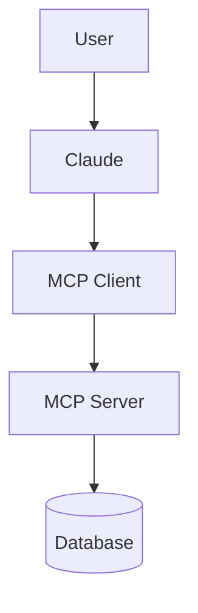
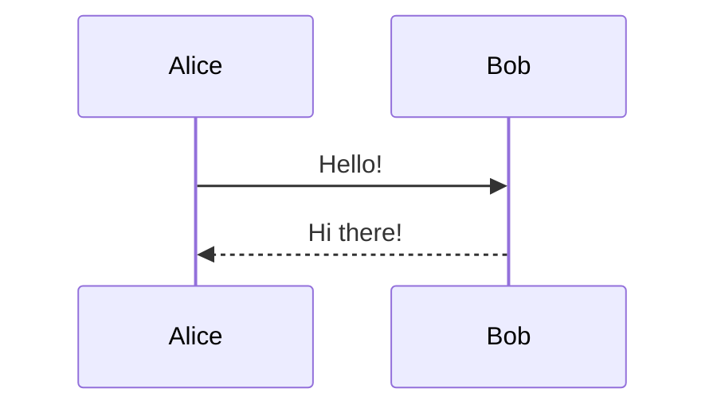

# 📄 md-to-pdf — Markdown + Mermaid → Beautiful PDF

A local Node.js tool that converts any Markdown file (with Mermaid diagrams) into a polished PDF — diagrams rendered as real visuals, not code blocks.

---

## How It Works

```
Your .md file
  │
  ├── Markdown text  ──→  marked (HTML renderer)
  └── ```mermaid```  ──→  Mermaid JS (renders to SVG)
                               │
                          Puppeteer (headless Chrome)
                               │
                           📄 output.pdf
```

---

## Prerequisites

You need **Node.js 18+** installed. Check with:

```bash
node --version
```

If you don't have it: https://nodejs.org

---

## Setup (One Time)

```bash
# 1. Go into this folder
cd md-to-pdf

# 2. Install dependencies (marked + puppeteer)
#    Puppeteer will also auto-download a local Chromium (~170MB)
npm install
```

That's it! No global installs needed.

---

## Usage

```bash
# Basic: converts input.md → input.pdf (same folder)
node convert.js input.md

# Custom output path
node convert.js my-notes.md ~/Desktop/output.pdf

# From a different folder
node convert.js /path/to/your/document.md /path/to/output.pdf
```

### Example

```bash
node convert.js mcp_explained.md mcp_explained.pdf
```

---

## Writing Mermaid in Your Markdown

Use fenced code blocks with the `mermaid` language tag — exactly the same syntax Claude generates:

````markdown
## My Architecture

Here is the system diagram:



And here is the sequence:


````

All standard Mermaid diagram types are supported:

| Type | Keyword |
|---|---|
| Flowchart | `graph` / `flowchart` |
| Sequence Diagram | `sequenceDiagram` |
| Class Diagram | `classDiagram` |
| State Diagram | `stateDiagram-v2` |
| Entity Relationship | `erDiagram` |
| Gantt Chart | `gantt` |
| Pie Chart | `pie` |
| Mindmap | `mindmap` |
| Timeline | `timeline` |
| Git Graph | `gitGraph` |
| User Journey | `journey` |

---

## PDF Output Features

- ✅ Mermaid diagrams rendered as real visuals (SVG)
- ✅ Indigo/purple theme matching the diagram style
- ✅ Beautiful tables with alternating row colors
- ✅ Syntax-highlighted code blocks
- ✅ Header with filename, footer with page numbers
- ✅ A4 format, print-optimized margins
- ✅ No external dependencies beyond npm

---

## Troubleshooting

**"Cannot find module 'puppeteer'"**
→ Run `npm install` inside the `md-to-pdf` folder.

**Diagrams show as empty boxes**
→ You need an internet connection the first time (Mermaid is loaded from CDN). Alternatively, see the "Offline Mode" note below.

**Puppeteer download is slow / fails**
→ Try: `PUPPETEER_DOWNLOAD_HOST=https://npmmirror.com npm install`

**PDF is cut off on some diagrams**
→ Large diagrams auto-scale. If a specific diagram is huge, add `%%{init: {'flowchart': {'useMaxWidth': true}}}%%` at the top of that mermaid block.

---

## Offline Mode (Optional)

To avoid the CDN dependency, copy the mermaid bundle locally:

```bash
# Download the mermaid bundle
curl -o mermaid.min.js https://cdn.jsdelivr.net/npm/mermaid@11/dist/mermaid.min.js
```

Then in `convert.js`, change this line:
```html
<script src="https://cdn.jsdelivr.net/npm/mermaid@11/dist/mermaid.min.js"></script>
```
To:
```html
<script src="file:///FULL/PATH/TO/md-to-pdf/mermaid.min.js"></script>
```

---

## File Structure

```
md-to-pdf/
├── convert.js      ← main script (this is all you need)
├── package.json    ← dependencies
├── package-lock.json  (generated after npm install)
└── node_modules/   (generated after npm install)
```
