# 🔌 MCP Protocol & MCP Servers — A Visual Guide

---

## 1. What Problem Does MCP Solve?

Before MCP, every AI assistant had to build **custom, one-off integrations** with every tool it wanted to use (like GitHub, Slack, databases, etc.). This was messy and hard to scale.

**MCP (Model Context Protocol)** is a universal standard — like a "USB-C for AI" — that lets any AI model talk to any tool using one consistent protocol.

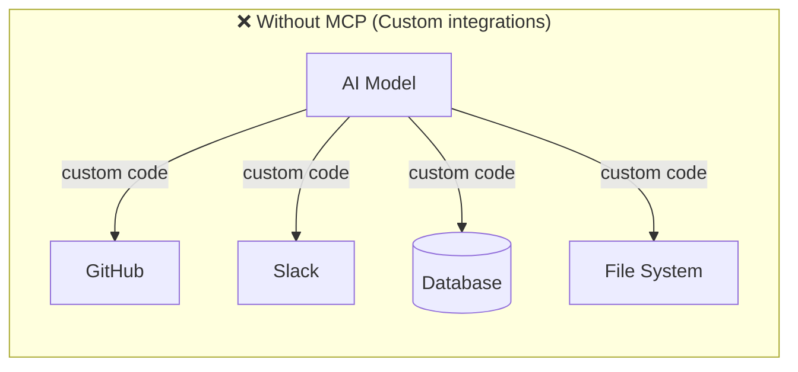

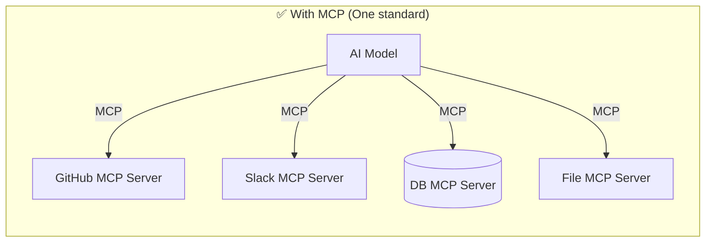

---

## 2. The Big Picture Architecture

MCP has **3 core players**:

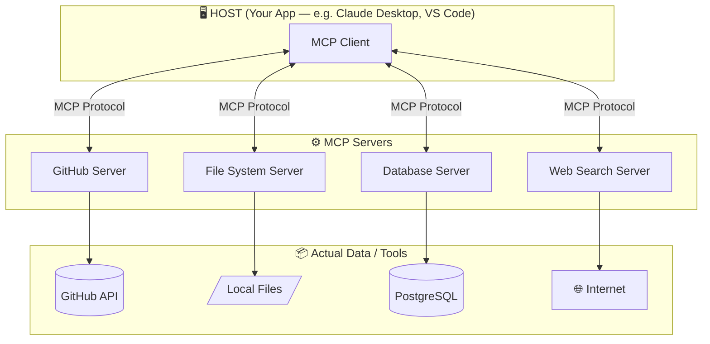

| Player | Who They Are | Analogy |
|---|---|---|
| **Host** | The app you're using (Claude Desktop, VS Code) | Your phone |
| **MCP Client** | Lives inside the host, speaks MCP | The App Store engine on your phone |
| **MCP Server** | A lightweight program exposing a tool/data source | An app you install |

---

## 3. What Can an MCP Server Offer?

Each MCP server can expose **3 types of capabilities**:

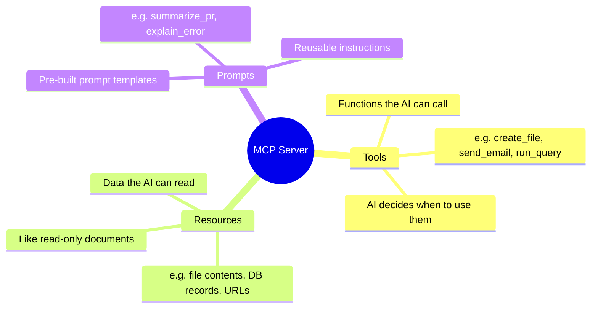

---

## 4. How a Conversation Actually Works (Step-by-Step Flow)

Here's what happens when you ask Claude *"Create a file called hello.txt"*:

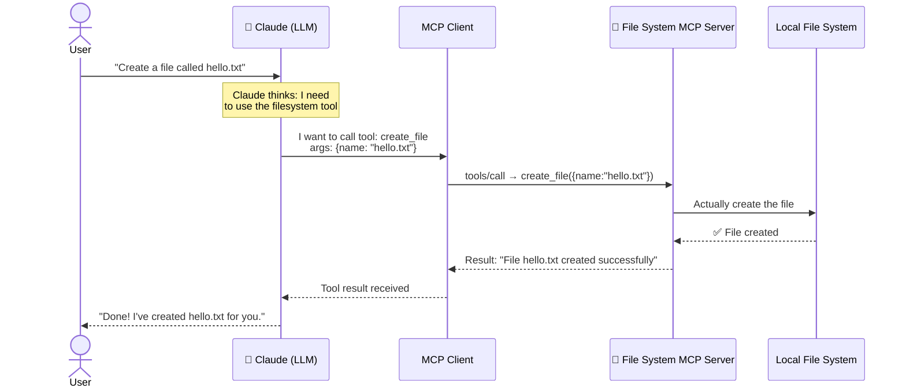

---

## 5. The MCP Handshake — How Client & Server Connect

When an MCP client first connects to a server, they do a **handshake** to discover capabilities:

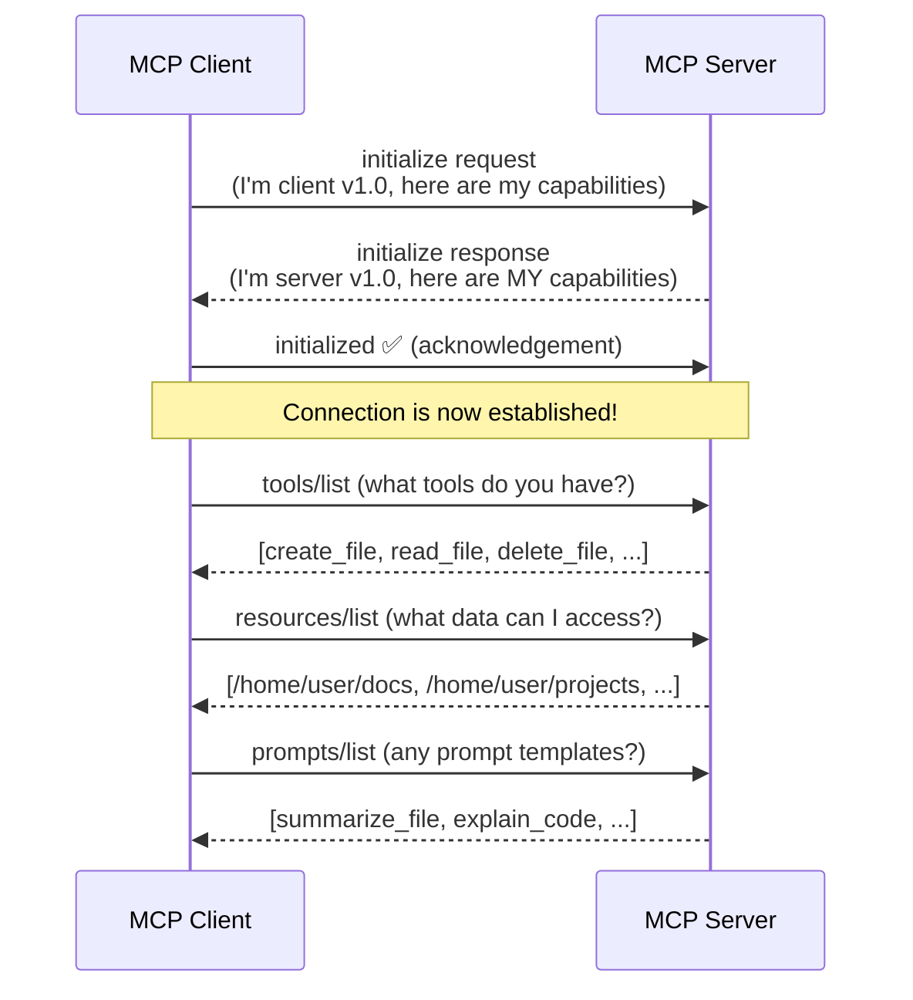

---

## 6. MCP Communication — The Transport Layer

MCP servers can communicate with clients over **2 transport types**:

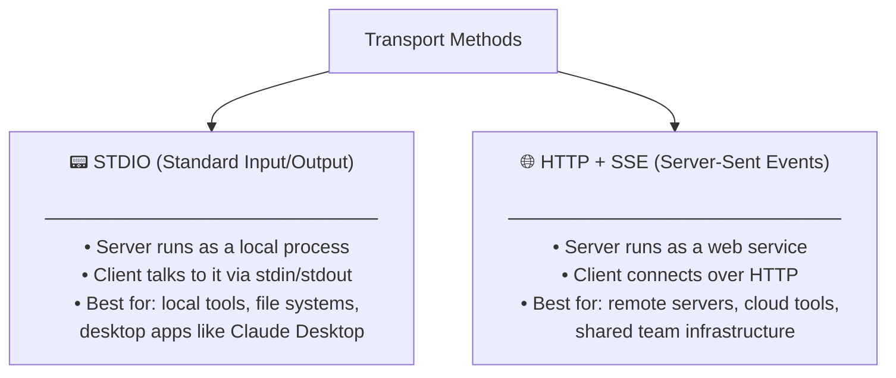

---

## 7. What Does an MCP Server Actually Look Like?

Here's a simplified mental model of an MCP server's code structure:

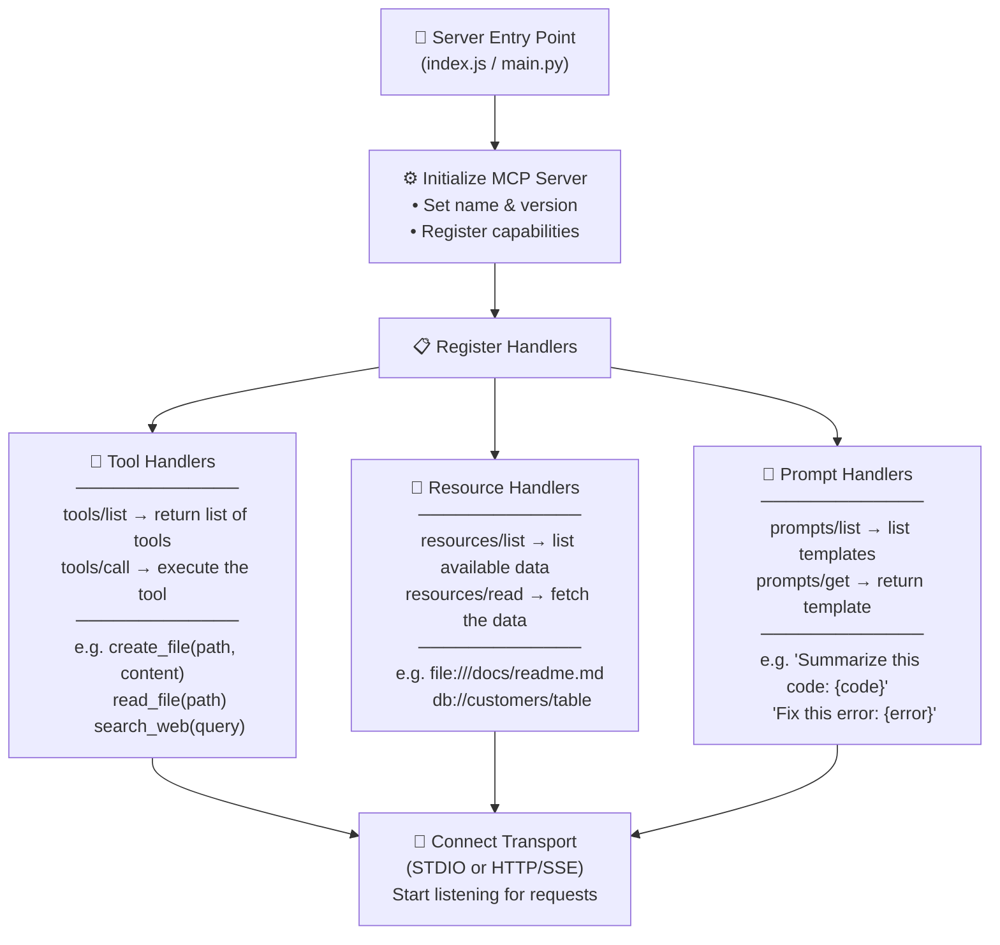

---

## 8. A Real-World Example — Claude + GitHub MCP Server

```mermaid
sequenceDiagram
  actor Dev as 👨‍💻 Developer
  participant Claude as 🤖 Claude
  participant GHMC as GitHub MCP Server
  participant GH as GitHub API

  Dev->>Claude: "List my open PRs and summarize the biggest one"

  Claude->>GHMC: tools/call: list_pull_requests({state: "open"})
  GHMC->>GH: GET /repos/.../pulls?state=open
  GH-->>GHMC: [PR#42 (2300 lines), PR#38 (120 lines), ...]
  GHMC-->>Claude: [{id:42, title:"...", additions:2300}, ...]

  Claude->>GHMC: tools/call: get_pull_request({pr_number: 42})
  GHMC->>GH: GET /repos/.../pulls/42 (with diff)
  GH-->>GHMC: Full PR diff and description
  GHMC-->>Claude: {diff: "...", description: "..."}

  Claude-->>Dev: "You have 2 open PRs. The largest is PR#42
  'Refactor auth system' — it changes the login flow,
  adds JWT tokens, and removes the old session-based auth..."
```

---

## 9. MCP vs Traditional APIs — Key Differences

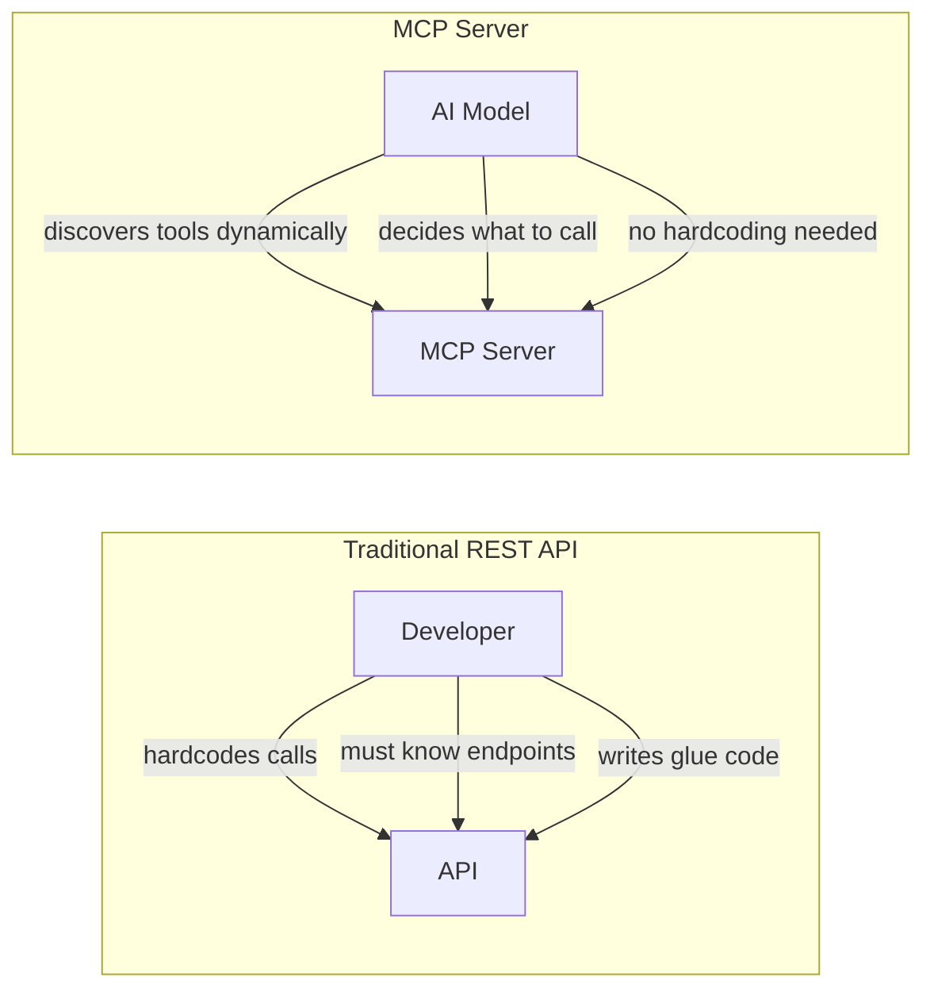

| Feature | REST API | MCP Server |
|---|---|---|
| Who decides what to call? | Developer (hardcoded) | AI Model (dynamic) |
| Discovery | Manual docs reading | Auto via `tools/list` |
| Context awareness | None | Full conversation context |
| Error handling | Manual | Built into protocol |
| AI-native? | ❌ | ✅ |

---

## 10. The Ecosystem Today

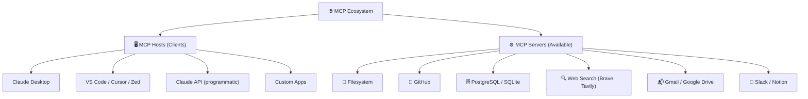

---

## 11. Summary — MCP in One Diagram

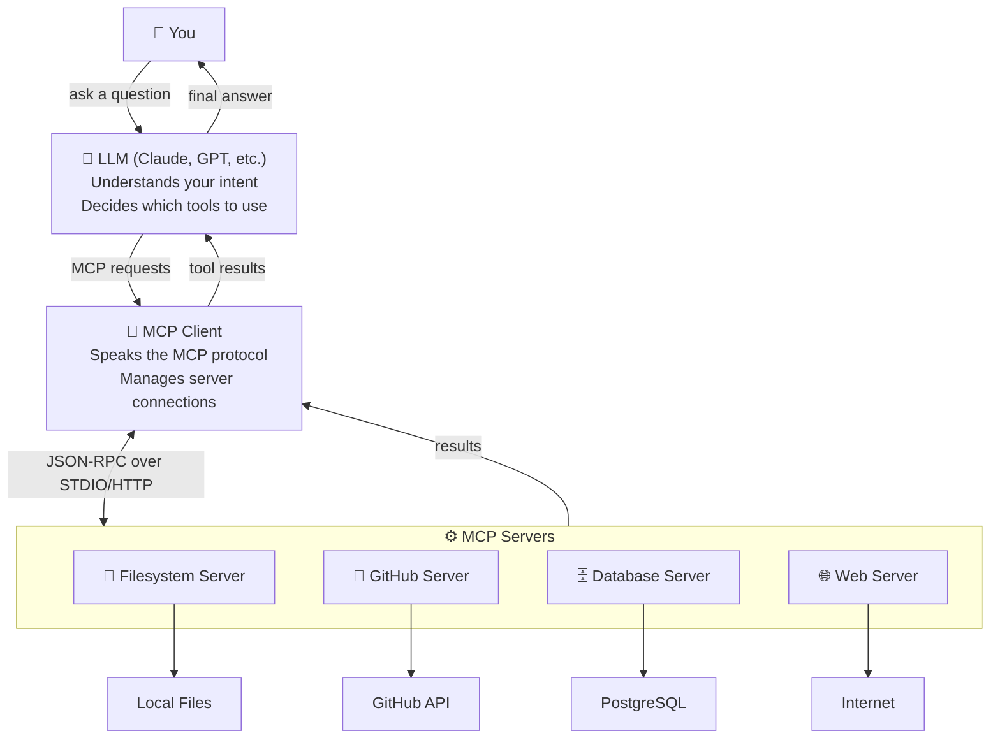

---

## Key Takeaways 🎯

- **MCP = USB-C for AI** — one standard plug for all tools
- An **MCP Server** wraps a tool/data source and exposes it as **Tools**, **Resources**, or **Prompts**
- The **MCP Client** (inside your app) discovers and calls these servers on behalf of the AI
- Communication uses **JSON-RPC 2.0** messages over **STDIO** (local) or **HTTP+SSE** (remote)
- The AI **dynamically decides** what to call — no hardcoding needed

> MCP was open-sourced by Anthropic in November 2024 and is now a rapidly growing standard adopted by Microsoft, Google, and hundreds of community contributors.
