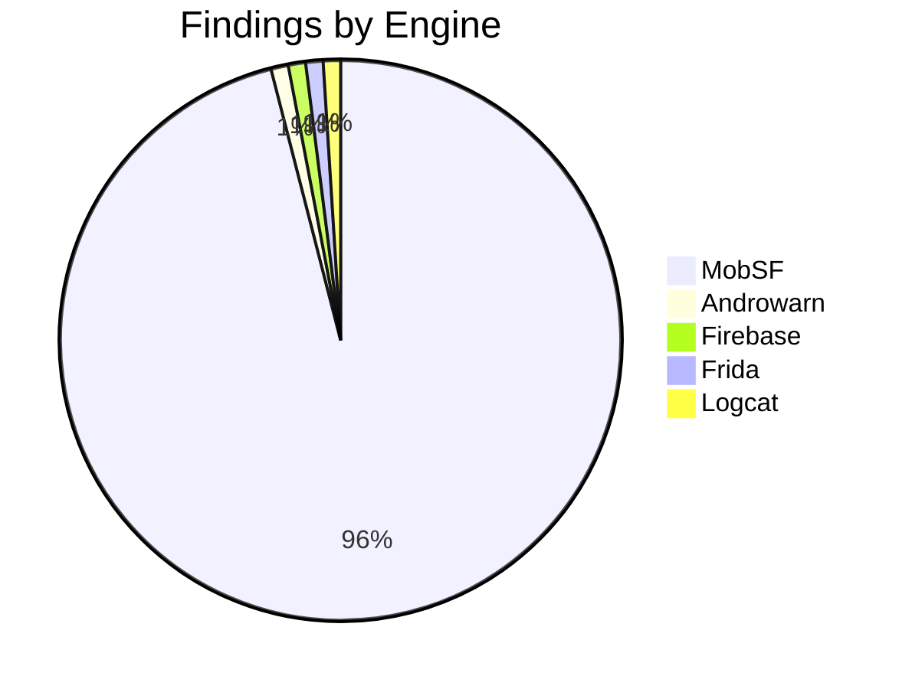
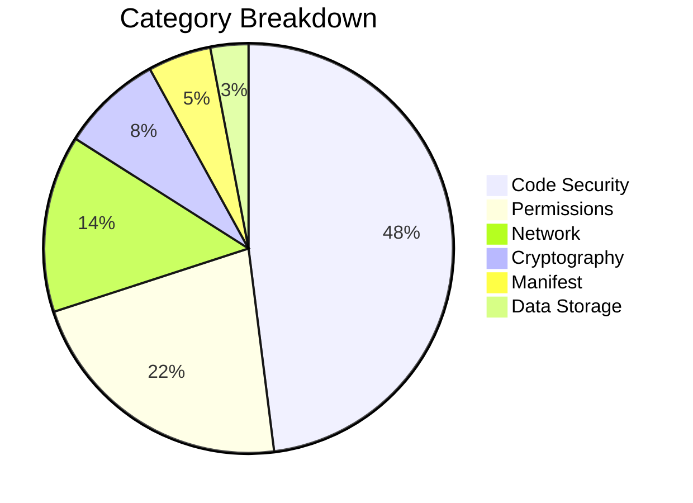
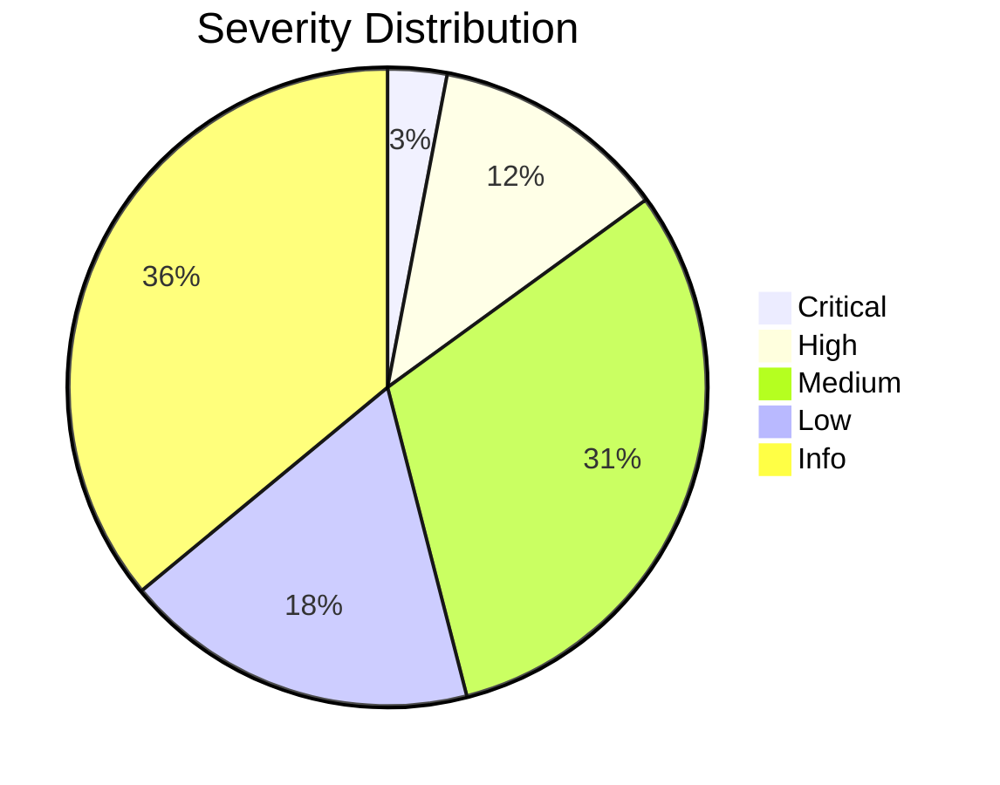
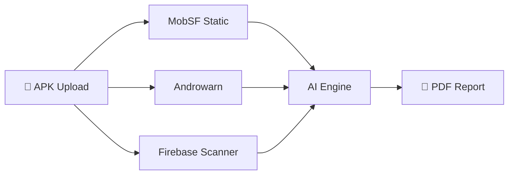

# ShinobiDroid — Chart Color Test

> Testing Mermaid pie chart colors with the new vivid theme.

---

## Findings by Engine

## Category Breakdown

## Severity Distribution

## Attack Surface Flow

